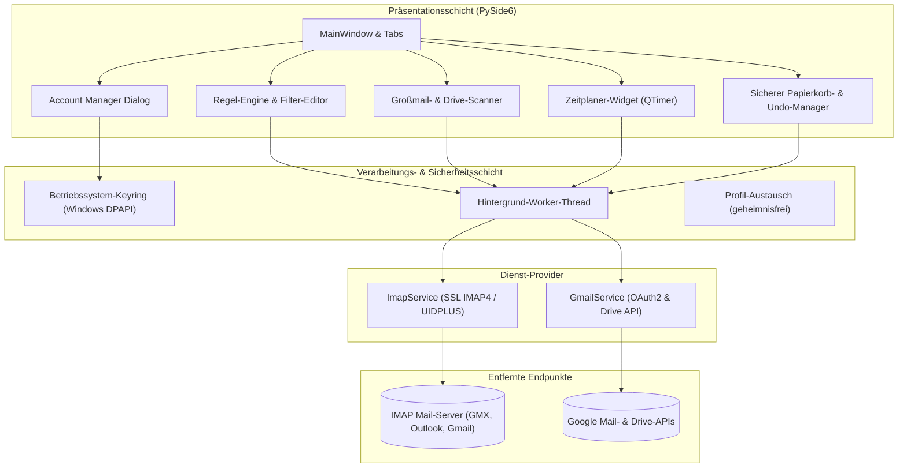
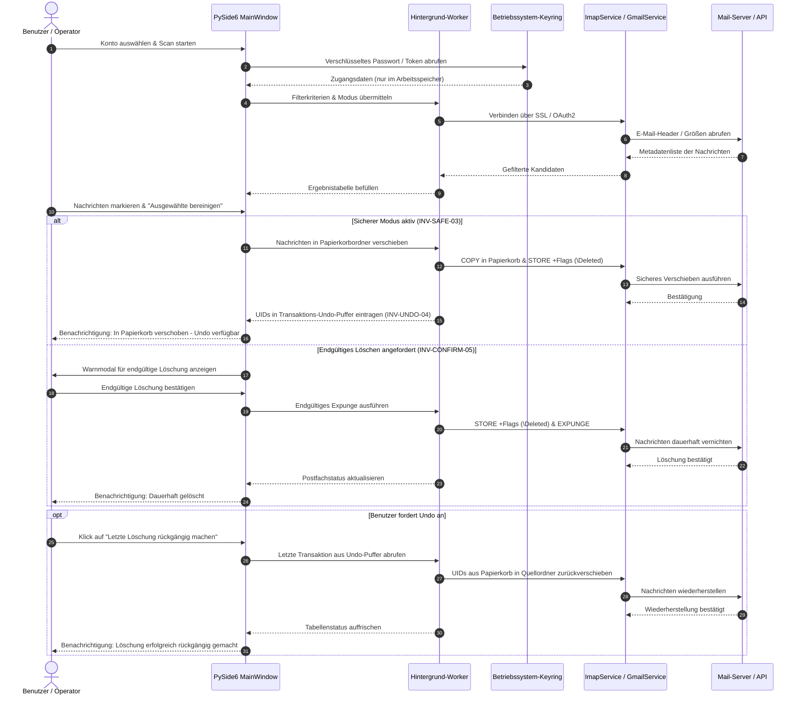

# UniversalMailCleaner

**[🇬🇧 English](README.md)** · **🇩🇪 Deutsche Dokumentation**

> Lokale Windows-Desktop-Anwendung zur Bereinigung von IMAP- und Gmail-Postfächern — regelbasierte Säuberung, Großmail-Scans, Zeitplaner und sicherer Papierkorbmodus mit Undo.

[](LICENSE)
[](CHANGELOG.md)
[](#schnellstart--installation)
[](https://pypi.org/project/PySide6/)
[](pyproject.toml)
[](tests)
[](SECURITY.md)
[](https://github.com/doc-bricks)
[](https://github.com/open-bricks)
[](llms.txt)

> [!NOTE]
> Maschinenlesbare Repository-Zusammenfassung für KI-Agenten und LLMs verfügbar unter [`llms.txt`](llms.txt). Audit-Berichte liegen in [`THIRD_PARTY_LICENSES.md`](THIRD_PARTY_LICENSES.md) und [`MARKETING-LOG.txt`](MARKETING-LOG.txt).

---

### Schnellnavigation

- [1. Architektur](#architektur)
- [2. Workflow-Lebenszyklus](#workflow-lebenszyklus)
- [3. Kernfähigkeiten & Sicherheitsinvarianten](#kernfähigkeiten--sicherheitsinvarianten)
- [4. Zielgruppen & Anwendungsfälle](#zielgruppen--anwendungsfälle)
- [5. Vergleichsmatrix & Alternativen](#vergleichsmatrix--alternativen)
- [6. Funktions-Highlights](#funktions-highlights)
- [7. Visuelle Oberfläche & Screenshot](#visuelle-oberfläche--screenshot)
- [8. Unterstützte Anbieter](#unterstützte-anbieter)
- [9. Schnellstart & Installation](#schnellstart--installation)
- [10. Konfiguration & Zugangsdaten-Sicherheit](#konfiguration--zugangsdaten-sicherheit)
- [11. Zeitplaner & Automatisierte Wartung](#zeitplaner--automatisierte-wartung)
- [12. Ökosystem & Geschwister-Werkzeuge](#ökosystem--geschwister-werkzeuge)
- [13. Drittanbieter-Lizenzen & Compliance](#drittanbieter-lizenzen--compliance)
- [14. Sicherheitsrichtlinie & SLAs](#sicherheitsrichtlinie--slas)
- [15. Lizenz & FAQ](#lizenz--faq)

---

## Architektur

UniversalMailCleaner nutzt eine mehrschichtige Desktop-Architektur, die für blockierungsfreie UI-Reaktionszeiten, strikte Geheimhaltungsisolation und lokale Ausführung konzipiert ist.



---

## Workflow-Lebenszyklus

Das folgende Sequenzdiagramm verdeutlicht die Trennung der Zugangsdaten, asynchrone Serverabfragen, die verschiebebasierte Papierkorb-Löschung mit Undo-Garantie und die Bestätigungsschranke bei endgültigem Löschen:



---

## Kernfähigkeiten & Sicherheitsinvarianten

UniversalMailCleaner basiert auf 10 nachprüfbaren Governance-, Architektur- und Laufzeit-Invarianten:

| Invarianten-Code | Kategorie | Name & Garantie | Verifikationsgrenze |
|---|---|---|---|
| `INV-LOCAL-01` | Architektur | **100% Local-First Ausführung** | Alle Postfachscans, Filterregeln und Cache-Dateien verbleiben strikt lokal; null Telemetrie oder Cloud-Analytics. |
| `INV-CRED-02` | Sicherheit | **Verschlüsselte Zugangsdaten-Isolation** | Passwörter und OAuth-Tokens werden über `keyring` im Betriebssystem-Tresor (Windows DPAPI) oder flüchtigen RAM gehalten; niemals im Klartext in `config.json`. |
| `INV-SAFE-03` | Sicherheit | **Standardmäßig sichere Löschung** | Der Standard-Betriebsmodus verschiebt E-Mails in den Papierkorb (`Trash`, `Papierkorb`, `[Gmail]/Trash`) statt sofortige Löschbefehle auszuführen. |
| `INV-UNDO-04` | Transaktion | **Transaktionale Undo-Fähigkeit** | Sichere Löschungen erfassen Nachrichten-UIDs und Ordnerpfade in einem flüchtigen Puffer für die sofortige Ein-Klick-Wiederherstellung. |
| `INV-CONFIRM-05` | Schutz | **Explizite Bestätigung bei Hard-Delete** | Dauerhaftes Vernichten (`EXPUNGE`) erfordert eine explizite Bestätigung über einen modalen Sicherheitsdialog. |
| `INV-TLS-06` | Netzwerk | **Erzwungene TLS-Transportsicherheit** | Die Netzwerkkommunikation erfordert zwingend `IMAP4_SSL` (Port 993) und TLS 1.3 / HTTPS für Google APIs; unverschlüsselte Klartextverbindungen werden abgewiesen. |
| `INV-LEASTPRIV-07` | Berechtigung | **Minimale OAuth2-Berechtigungen** | Google OAuth2 fordert nur die minimal benötigten Scopes an (`gmail.modify`, optional `drive.file` / `drive.metadata.readonly`); keine Administratorenrechte. |
| `INV-LAZYLOAD-08` | Laufzeit | **Lazy-Loading optionaler Abhängigkeiten** | Google-Client-Bibliotheken (`google-api-python-client`, `google-auth-oauthlib`) werden nur bei Bedarf geladen; reine IMAP-Nutzer starten ohne Google-Abhängigkeiten. |
| `INV-PORTABLE-09` | Portabilität | **Geheimnisfreier Profil-Export** | Exportierte Regelprofile (`profile_exchange.py`) entfernen alle Zugangsdaten und Tokens für den sicheren Austausch zwischen Rechnern. |
| `INV-SLA-10` | Governance | **48h Sicherheits-SLA & 5-Tage-Triage** | Dokumentierte Reaktionsfristen in `SECURITY.md`: Rückmeldung innerhalb von 48 Stunden und Schwachstellen-Triage innerhalb von 5 Werktagen. |

---

## Zielgruppen & Anwendungsfälle

UniversalMailCleaner adressiert vier zentrale Anwendergruppen mit hohen Ansprüchen an Privatsphäre und Postfachhygiene:

1. **Datenschutzbewusste Fachanwender & DS-GVO-Verantwortliche**
   - *Problem:* Benötigen saubere Postfächer, automatisierte Aufbewahrungsfristen und Newsletter-Bereinigung, ohne sensible Mandanten- oder Kundendaten über Cloud-Aggregatoren zu leiten.
   - *Lösung:* 100% Local-First Ausführung (`INV-LOCAL-01`) ohne Telemetrie, unprivilegierter Desktop-Betrieb und verschlüsselte Betriebssystem-Passwortspeicherung.
2. **Speicherplatz-limitierte Gmail- & IMAP-Nutzer**
   - *Problem:* Erreichen der Speicherobergrenze bei Gmail (15 GB geteiltes Kontingent) oder Firmen-IMAP-Konten; drohende teure monatliche Abo-Upgrades.
   - *Lösung:* Tabellarischer Multi-Kriterien-Scanner für große E-Mails und Google Drive-Dateien zur gezielten Freigabe von Gigabytes ohne laufende Kosten.
3. **Power-User & digitale Minimalisten**
   - *Problem:* Verwaltung mehrerer Postfächer (GMX, Outlook, Gmail, Web.de), die von zehntausenden alten Werbemails und automatisierten Benachrichtigungen verstopft sind.
   - *Lösung:* Schneller Kontowechsel, automatisierte Hintergrund-Wartungsintervalle und sicherer Papierkorbmodus mit Ein-Klick-Undo.
4. **Solo-Entwickler & Systemadministratoren**
   - *Problem:* Kommerzielle Aufräum-Tools sind Abo-Fallen, die E-Mail-Metadaten monetarisieren oder Adresslisten für Marketingzwecke auswerten.
   - *Lösung:* Kostenloses, quelloffenes MIT-Python-Desktopwerkzeug mit auditierbarem Code, modularem Aufbau und geheimnisfreiem Profilaustausch.

---

## Vergleichsmatrix & Alternativen

| Dimension | UniversalMailCleaner | Cloud-Postfachbereiniger (Cleanfox/Unroll.me) | Kommerzielle Aggregatoren (Mailstrom/SaneBox) | Webmail / Native Clients (Thunderbird/Gmail) | Eigene Skripte (Python/Bash) |
|---|---|---|---|---|---|
| **Architektur & Privatsphäre** | **100% Lokaler Desktop (Zero-Egress)** | Cloud-Backend-Verarbeitung | Cloud-SaaS-Polling | Lokaler / Web-Client | Lokales CLI-Skript |
| **Nachrichteninhalt & Metadaten** | **Ausschließlich lokal verarbeitet** | Auf Herstellerservern ausgewertet | In Hersteller-Cloud gespeichert | Provider-verwaltet | Lokales Terminal |
| **Datenmonetarisierung** | **Null (MIT Open Source)** | Aggregiert & für Marketing verwertet | Teure monatliche Abos | Ökosystem-Tracking | Keine |
| **Sicherer Modus & Undo** | **Sicherer Papierkorb + 1-Klick-Undo** | Nur Papierkorb / Abbestellen | Nur Papierkorb | Manuelles Verschieben / Senden rückgängig | Hohes EXPUNGE-Risiko |
| **Zugangsdaten-Sicherheit** | **Betriebssystem-Keyring (DPAPI)** | Cloud-OAuth / Passwörter gespeichert | Cloud-IMAP / OAuth gespeichert | Lokaler Passwort-Cache | Klartext / Umgebungsvariablen |
| **Automatischer Zeitplaner** | **Lokaler QTimer-Zeitplaner** | Cloud-Hintergrundabfragen | Geplante Cloud-Läufe | Serverregeln (stark limitiert) | OS Taskplaner / Cron |
| **Großdatei-Auffindung** | **Tabellarisch (Mail + Drive)** | Zusammenfassung nach Absender | Kategorien-Bündelung | Manuelle Suchleiste | Eigene IMAP-Abfragen |
| **Kosten & Lizenz** | **100% Kostenlos & Open Source (MIT)** | "Kostenlos" gegen Datennutzung | 9 - 30 € / Monat | Kostenlos mit Konto | Kostenlos |
| **Abhängigkeits-Isolation** | **Eigenständig + Lazy Google-Loading** | Gehosteter Dienst | Gehosteter Dienst | Schweres Mail-Programm | Python Standardbibliothek |
| **Geschwister-Ökosystem** | **doc-bricks & open-bricks** | Proprietäres Silo | Proprietäres Silo | Hersteller-Silo | Isoliert |

---

## Funktions-Highlights

- **Verwaltung mehrerer Konten:** Parallele Konfiguration von SSL-IMAP-Konten (GMX, Outlook, Web.de, eigene Mailserver) und Gmail API OAuth2-Profilen.
- **Lazy-Loading der Google APIs:** Google-Pakete werden nur geladen, wenn tatsächlich ein Gmail-API-Konto authentifiziert wird. Reine IMAP-Setups starten ohne Google-Bibliotheken.
- **Hardware-gestützte Passwortsicherheit:** Zugangsdaten liegen über `keyring` sicher in der Windows-Anmeldeinformationsverwaltung (DPAPI), mit Fallback auf flüchtigen Arbeitsspeicher.
- **Regelbasierte Filter-Engine:** Erstellung kombinierter Filterregeln nach Alter (z. B. älter als 90 Tage), Absendermuster, Betreff-Stichwörtern und Mindestgröße.
- **Standardmäßig sicherer Löschmodus:** Löschvorgänge verschieben Nachrichten in den Papierkorb des Anbieters statt sie sofort dauerhaft zu entfernen.
- **Transaktionales Undo:** Letzter Batch gelöschter E-Mails lässt sich per Klick über UIDs wieder in den ursprünglichen Ordner zurückholen.
- **Großmail- & Drive-Scanner:** Tabellarische Übersicht der speicherintensivsten Mails und optionalen Google Drive-Dateien, sortierbar nach Größe mit Direktauswahl.
- **Gmail Speicher- & Label-Analyse:** Speicherquoten in Echtzeit, label-spezifische Bereinigungs-Tabs und gezieltes Leeren des Papierkorbs.
- **Geheimnisfreier Profilaustausch:** Export und Import von Bereinigungsregeln und Kontovorlagen ohne Weitergabe von Passwörtern oder Tokens.
- **Konfigurierbare Protokollierung:** Detaillierungsgrad über die Umgebungsvariable `UMAIL_CLEANER_LOG_LEVEL` anpassbar.

---

## Visuelle Oberfläche & Screenshot

UniversalMailCleaner bietet eine übersichtliche PySide6-Benutzeroberfläche zur Steuerung von Konten, Filterregeln, Großmail-Scans, Zeitplanern und Undo-Aktionen:


---

## Unterstützte Anbieter

- **GMX:** `imap.gmx.net:993` über SSL
- **Outlook / Office 365:** `outlook.office365.com:993` über SSL
- **Gmail via IMAP:** `imap.gmail.com:993` mit App-Passwort
- **Gmail via Gmail API:** OAuth2-Authentifizierung (`credentials.json` erforderlich)
- **Web.de:** `imap.web.de:993` über SSL
- **Generisches IMAP:** Jeder RFC-3501-konforme IMAP4-Server mit SSL/TLS auf Port 993

---

## Schnellstart & Installation

### Windows-Starter

Doppelklick auf `START.bat` im Hauptverzeichnis startet die Desktop-Anwendung direkt.

### Installation über pip

```bash
# Repository klonen
git clone https://github.com/doc-bricks/UniversalMailCleaner.git
cd UniversalMailCleaner

# Im Entwicklungsmodus installieren
pip install -e .

# Anwendung starten
universalmailcleaner
```

### Direkter Skriptstart

```bash
pip install -r requirements.txt
python mail_imap_cleaner_v1.py
```

### Tests ausführen

```bash
pytest tests -v
```

---

## Konfiguration & Zugangsdaten-Sicherheit

- **Konfigurationsdatei:** Liegt unter `%USERPROFILE%\.mail_cleaner\config.json`.
- **Keine Klartext-Passwörter:** Zugangsdaten und OAuth-Tokens sind strikt von der JSON-Konfiguration entkoppelt und liegen im Windows-Tresor (`INV-CRED-02`).
- **Sicherer Modus erzwungen:** Der sichere Papierkorbmodus ist bei jedem Anwendungsstart standardmäßig aktiv (`INV-SAFE-03`).

---

## Zeitplaner & Automatisierte Wartung

UniversalMailCleaner enthält ein integriertes Modul `scheduler_widget.py`, das über hochpräzise `QTimer`-Ereignisse gesteuert wird:
- Automatische Regelausführung in frei definierbaren Intervallen (z. B. alle 6 Stunden, täglich oder wöchentlich).
- Zeitgesteuerte Wartungsläufe erfolgen ausnahmslos im sicheren Modus, um unbeaufsichtigten Datenverlust auszuschließen.
- Statusprotokolle und Ausführungszeitstempel werden direkt im Zeitplaner-Panel angezeigt.

---

## Ökosystem & Geschwister-Werkzeuge

UniversalMailCleaner ist ein zentraler Baustein der **doc-bricks** Produktivitäts- und Dokumentensuite unter dem Dach von **open-bricks**:

| Werkzeug | Schwerpunkt & Einsatzzweck | Status |
|---|---|---|
| [MailProcessor](https://github.com/doc-bricks/MailProcessor) | Tray-Starter und Orchestrator für alle Universal-Mail-Tools | Produktion |
| [UniversalDocsGrabber](https://github.com/doc-bricks/UniversalDocsGrabber) | Regelbasierte Extraktion von Anhängen und Dokumenten aus IMAP-Postfächern | Produktion |
| [UniversalInvoiceMail](https://github.com/doc-bricks/UniversalInvoiceMail) | Automatisierter Abruf und Zuordnung von Rechnungen und Belegen aus E-Mails | Produktion |
| [DokuZen](https://github.com/doc-bricks/DokuZen) | Lokale Dokumenten- und PDF-Verwaltungssuite (22 Werkzeuge in PySide6) | Produktion |
| [PDFtoPDFocr](https://github.com/doc-bricks/PDFtoPDFocr) | Desktop-Anwendung für Texterkennung (OCR) in gescannten PDFs | Produktion |
| [MediaBrain](https://github.com/doc-bricks/MediaBrain) | Multi-Format Medien- und Dokumentenmetadaten-Analyzer | Produktion |
| [ProFiler](https://github.com/file-bricks/ProFiler) | Schnelle Datei- und Ordnerorganisation mit Batch-Workflows | Produktion |

---

## Drittanbieter-Lizenzen & Compliance

Alle Drittanbieter-Abhängigkeiten sind in [`THIRD_PARTY_LICENSES.md`](THIRD_PARTY_LICENSES.md) dokumentiert:
- **PySide6:** Qt-for-Python-Framework (`LGPL-3.0-only` / `GPL-2.0-only` / `GPL-3.0-only`). Dynamisch verlinkt ohne virale Lizenzinfektion.
- **keyring:** Windows DPAPI-Passwortspeicherung (`MIT`).
- **google-auth-oauthlib & google-api-python-client:** Permissiv (`Apache-2.0`). Dynamisch bei Bedarf geladen.
- **Vollständig permissiv:** Der gesamte eigene Quellcode steht unter der freien MIT-Lizenz.

---

## Sicherheitsrichtlinie & SLAs

Sicherheitsanfragen und Schwachstellenmeldungen unterliegen der Richtlinie in [`SECURITY.md`](SECURITY.md):
- **Reaktionszeit-SLA:** Erste Eingangsbestätigung innerhalb von **48 Stunden** (`INV-SLA-10`).
- **Triage-SLA:** Bewertung und Einstufung innerhalb von **5 Werktagen**.
- **Sicherheitskontakt:** `security@open-bricks.org` oder `security@doc-bricks.org`.

---

## Lizenz & FAQ

Lizenziert unter der [MIT-Lizenz](LICENSE).

### FAQ

**Gmail-Login schlägt fehl?**
- *Bei IMAP:* 2-Faktor-Authentifizierung aktivieren und ein App-Passwort unter [myaccount.google.com/apppasswords](https://myaccount.google.com/apppasswords) anlegen.
- *Bei Gmail API:* OAuth-Clientdaten als `credentials.json` im Programmordner ablegen und die einmalige Browser-Anmeldung abschließen.

**Wie funktioniert das Rückgängigmachen (Undo)?**
Im sicheren Modus werden gelöschte Nachrichten zunächst in den Papierkorb des Anbieters kopiert. Ein Klick auf "Letzte Löschung rückgängig machen" überträgt die erfassten UIDs direkt wieder in den Quellordner zurück.

**Muss Google Drive zwingend bereinigt werden?**
Nein. Der Google Drive-Scan ist vollständig optional und standardmäßig deaktiviert. Er wird nur aktiv, wenn ein Konto über die Gmail API mit entsprechendem Drive-Scope verbunden wird.
