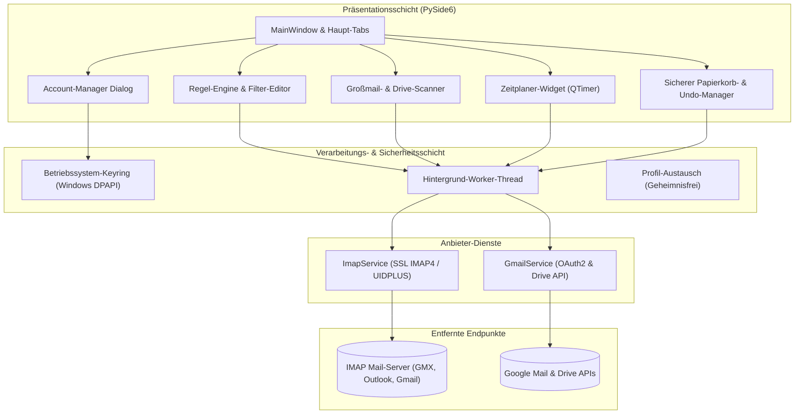
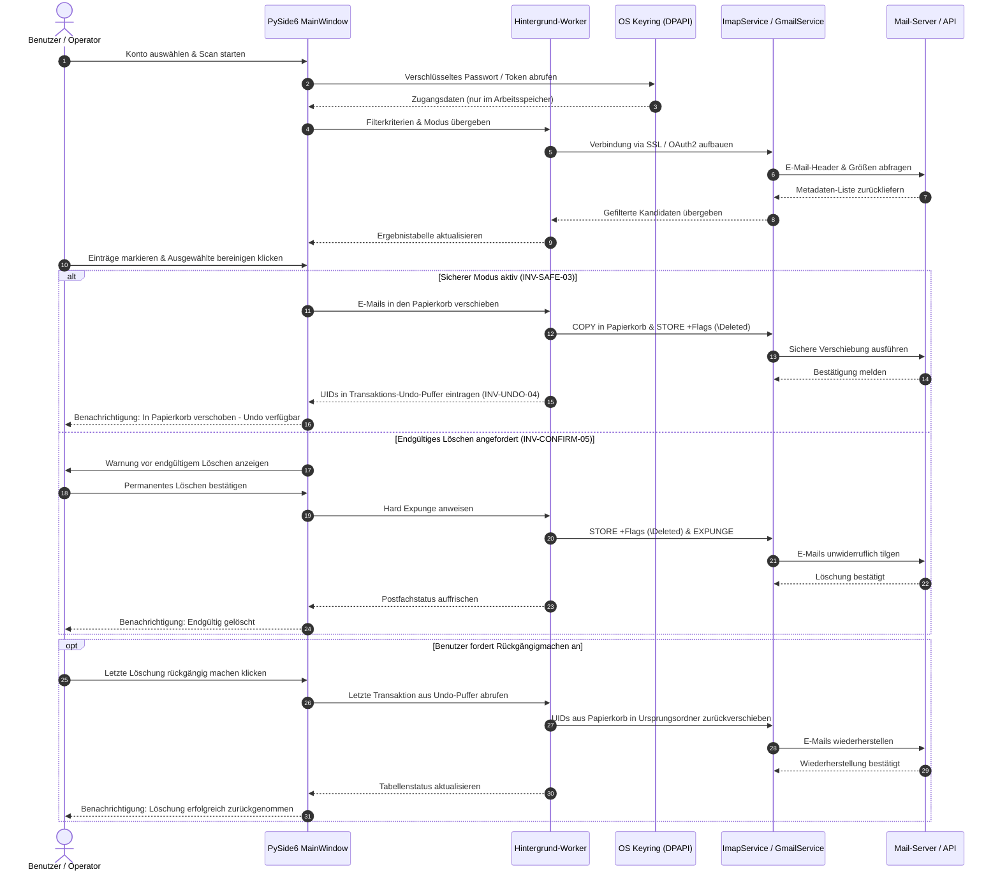
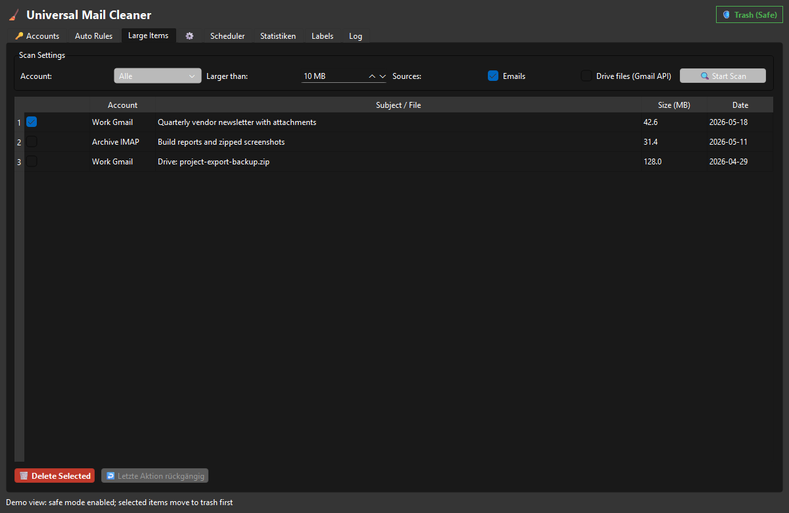

# UniversalMailCleaner

**[🇬🇧 English](README.md)** · **🇩🇪 Deutsche Dokumentation**

> Lokale Windows-Desktop-Anwendung zur Bereinigung von IMAP- und Gmail-Postfächern — regelbasierte Säuberung, Großmail-Scans, Zeitplaner und sicherer Papierkorbmodus mit Undo.

[](LICENSE)
[](NOTICE)
[](CHANGELOG.md)
[](#sec-10)
[](https://pypi.org/project/PySide6/)
[](pyproject.toml)
[](tests)
[](SECURITY.md)
[](https://github.com/doc-bricks)
[](https://github.com/open-bricks)
[](THIRD_PARTY_LICENSES.md)
[](THIRD_PARTY_LICENSES.txt)
[](CONTRIBUTING.md)
[](MARKETING-LOG.txt)
[](llms.txt)

> [!NOTE]
> Maschinenlesbare Repository-Zusammenfassung für KI-Agenten und LLMs verfügbar unter [`llms.txt`](llms.txt). Audit-Berichte liegen in [`THIRD_PARTY_LICENSES.md`](THIRD_PARTY_LICENSES.md) und [`MARKETING-LOG.txt`](MARKETING-LOG.txt).

---

### 🧭 Schnellnavigation

1. [Architektur & Entwurfsprinzipien](#sec-01)
2. [Workflow-Lebenszyklus & Zustandsautomat](#sec-02)
3. [Visuelle Oberfläche & Bildschirmfotos](#sec-03)
4. [Kernfähigkeiten & Invarianten](#sec-04)
5. [Funktions-Highlights & Schutznetze](#sec-05)
6. [Zielgruppen & Suchintentionen](#sec-06)
7. [Vergleichsmatrix gegenüber Alternativen](#sec-07)
8. [Laufzeit-Invarianten & Sicherheitsgarantien](#sec-08)
9. [Unterstützte Anbieter & Protokolle](#sec-09)
10. [Schnellstart & Installation](#sec-10)
11. [Konfiguration & Zugangsdaten-Sicherheit](#sec-11)
12. [Zeitplaner & Automatisierte Wartung](#sec-12)
13. [Testen, Verifikation & Qualitäts-Gates](#sec-13)
14. [Ökosystem & Geschwister-Werkzeuge](#sec-14)
15. [Drittanbieter-Lizenzen & Level 1 SBOM](#sec-15)
16. [Marketing-Strategie & Zielgruppen-Journey](#sec-16)
17. [Lizenz & Urheberrecht](#sec-17)
18. [Gesetzlicher Hinweis (§ 521 BGB) & Sicherheits-SLA](#sec-18)

---

<a id="sec-01"></a><a id="architecture"></a><a id="architektur"></a>
## 1. 🏗️ Architektur & Entwurfsprinzipien

UniversalMailCleaner nutzt eine mehrschichtige Desktop-Architektur, die für blockierungsfreie UI-Reaktionszeiten, strikte Geheimhaltungsisolation und lokale Ausführung konzipiert ist.



### ASCII Vier-Sichten Systemarchitektur-Topologie

```text
+===================================================================================================================+
|                              UNIVERSALMAILCLEANER SYSTEMARCHITEKTUR-TOPOLOGIE (4 SICHTEN)                         |
+===================================================================================================================+
| [SICHT 1: DESKTOP-BENUTZEROBERFLÄCHE & INTERAKTIONS-SCHICHT]                                                      |
|  * PySide6 Qt GUI Präsentationsschicht (mail_imap_cleaner_v1.py MainWindow) mit reaktiver, blockierungsfreier UI  |
|  * Multi-Tab Arbeitsbereich: Konten-Manager, Filterregeln-Editor, Großmail- & Drive-Scanner,                      |
|    Zeitplaner-Widget (scheduler_widget.py) und Gmail-Label-Verwaltung                                             |
|  * Unprivilegierte Benutzermodus-Ausführung [INV-USER-02] -- RunAsInvoker, keinerlei Administratorrechte nötig    |
|  * Sicherheits-Bedienelemente: Sicherer Papierkorb-Modus [INV-SAFE-03], 1-Klick Transaktions-Undo [INV-UNDO-04]   |
|    und explizite Sicherheits-Bestätigungsdialoge vor endgültigem Löschen [INV-CONFIRM-05]                         |
+-------------------------------------------------------------------------------------------------------------------+
                                                          |
                                                          v
+-------------------------------------------------------------------------------------------------------------------+
| [SICHT 2: UNIVERSALMAILCLEANER KERN-ENGINE & ASYNCHRONE WORKER]                                                   |
|  * Asynchroner Hintergrund-Worker (workers.py WorkerThread) verhindert Einfrieren der Oberfläche bei großen       |
|    Postfach-Abfragen und Netzwerk-Operationen [INV-LAZYLOAD-08]                                                   |
|  * Multi-Kriterien Regel-Engine: Betreff-, Absender-, Alters- (RFC 3501 IMAP-003 Formatierung), Größen- & Regex-Scan |
|  * Papierkorb- & Undo-Manager: Protokolliert Nachrichten-UIDs für sofortige, verlustfreie Wiederherstellung       |
|  * Profil-Serialisierungs-Engine (profile_exchange.py) -- Geheimnisfreier JSON-Regel-Export/Import [INV-PORTABLE-09] |
|  * Lazy-Dependency-Isolation [INV-LAZYLOAD-08] -- Google-Bibliotheken werden nur bei Bedarf geladen              |
+-------------------------------------------------------------------------------------------------------------------+
                                                          |
                                                          v
+-------------------------------------------------------------------------------------------------------------------+
| [SICHT 3: ZUGANGSDATEN-SCHUTZ & PROTOKOLL-ENDPUNKTE (IMAP & GMAIL)]                                               |
|  * Windows Anmeldeinformationsverwaltung / DPAPI via keyring [INV-CRED-02] -- Keine Klartext-Passwörter auf Disk |
|  * Hochperformanter SSL IMAP4 Client (imap_client.py) mit RFC 3501 UIDPLUS und erzwungenem TLS [INV-TLS-06]      |
|  * Google REST API Adapter (gmail_service.py) mit OAuth2-Authentifizierung und Minimal-Berechtigungen            |
|    (gmail.modify, drive.file) [INV-LEASTPRIV-07]                                                                  |
|  * Lokaler Konfigurationsstatus: Atomare Speicherung außerhalb von Cloud-Synchronisationspfaden (AppData)         |
+-------------------------------------------------------------------------------------------------------------------+
                                                          |
                                                          v
+-------------------------------------------------------------------------------------------------------------------+
| [SICHT 4: LOKALER SCHUTZPERIMETER, ZERO-EGRESS & WIDERRUFS-SICHERHEIT]                                            |
|  * 100% Lokale Ausführung & Zero-Egress [INV-LOCAL-01] -- Keinerlei Telemetrie, Analyse-Tracking oder Fremdserver|
|  * Permissive Open-Source-Lizenzierung (MIT) mit dynamischer Verlinkungskonformität für PySide6 LGPL-3.0         |
|  * Multi-Host Cloud-Sync- & Lock-Schutz -- Gehärtete .gitignore, Konfliktkopie-Resistenz, kanonische Lock-Wächter|
|  * Gesetzlicher Haftungsausschluss nach deutschem Zivilrecht (§ 521 BGB Gefälligkeitsrecht)                       |
|  * Duale Sicherheitsreaktions-Garantie [INV-SLA-10] -- 48h Reaktions-SLA & 5-Tage-Triage-Zusage                 |
+===================================================================================================================+
```

---

<a id="sec-02"></a><a id="workflow-lifecycle"></a><a id="workflow-lebenszyklus"></a>
## 2. 🔄 Workflow-Lebenszyklus & Zustandsautomat

Die folgende Sequenz beschreibt, wie UniversalMailCleaner Zugangsdaten isoliert, Mail-Server über Hintergrund-Worker-Threads abfragt, sichere Löschungen in die Papierkörbe der Anbieter mit sofortiger Undo-Garantie ausführt und für permanente Löschungen eine explizite Bestätigung verlangt:



---

<a id="sec-03"></a><a id="visual-interface--screenshot"></a><a id="visuelle-oberflaeche--screenshot"></a>
## 3. 🖥️ Visuelle Oberfläche & Bildschirmfotos

UniversalMailCleaner bietet eine aufgeräumte PySide6-Desktop-Oberfläche zur Verwaltung von Konten, Filterregeln, Großmail-Scannern, Zeitplaner-Profilen und Undo-Operationen:



---

<a id="sec-04"></a><a id="core-capabilities--security-invariants"></a><a id="kernfaehigkeiten--sicherheitsinvarianten"></a>
## 4. 🛡️ Kernfähigkeiten & Invarianten

UniversalMailCleaner basiert auf 10 nachweisbaren Sicherheits-, Architektur- und Betriebsinvarianten:

| Invarianten-Code | Kategorie | Name & Garantie | Verifikationsgrenze |
|---|---|---|---|
| `INV-LOCAL-01` | Architektur | **100% Local-First Ausführung** | Alle Verarbeitungen, Filterregeln und Cache-Dateien verbleiben vollständig lokal; null externe Telemetrie. |
| `INV-CRED-02` | Sicherheit | **Verschlüsselte Zugangsdaten-Isolation** | Passwörter und Tokens werden über `keyring` in der Windows-Tresorverwaltung (DPAPI) verwahrt; niemals im Klartext in `config.json`. |
| `INV-SAFE-03` | Sicherheit | **Standardmäßiger Papierkorb-Modus** | Standardmodus leitet alle Löschungen in den Papierkorb des Anbieters (`Trash`, `Papierkorb`, `[Gmail]/Trash`) statt sofort zu löschen. |
| `INV-UNDO-04` | Transaktion | **Transaktionale Undo-Fähigkeit** | Sichere Löschungen hinterlegen UIDs und Ordner im Speicher, was eine sofortige 1-Klick-Wiederherstellung ermöglicht. |
| `INV-CONFIRM-05` | Schutz | **Explizite Bestätigung für Hard-Delete** | Unwiderrufliches Löschen (`EXPUNGE`) erfordert eine explizite Bestätigung im modalen Warndialog. |
| `INV-TLS-06` | Netzwerk | **Erzwungene TLS-Transportsicherheit** | Kommunikation erfordert zwingend `IMAP4_SSL` (Port 993) und TLS 1.3 / HTTPS für Google APIs; unverschlüsselte Verbindungen werden abgewiesen. |
| `INV-LEASTPRIV-07` | Berechtigung | **Minimal-Rechte-Prinzip bei OAuth2** | Google OAuth2 fordert nur minimal nötige Scopes (`gmail.modify`, optional `drive.file` / `drive.metadata.readonly`); keine Kontovollmachten. |
| `INV-LAZYLOAD-08` | Laufzeit | **Lazy-Loading optionaler Abhängigkeiten** | Google-Bibliotheken (`google-api-python-client`, `google-auth-oauthlib`) werden nur bei Bedarf geladen; reine IMAP-Nutzer haben null Google-Overhead. |
| `INV-PORTABLE-09` | Portabilität | **Geheimnisfreie Profil-Portabilität** | Exportierte Regelprofile (`profile_exchange.py`) entfernen sämtliche Zugangsdaten; gefahrlos versionierbar und übertragbar. |
| `INV-SLA-10` | Governance | **48h Sicherheits-SLA & 5-Tage-Triage** | Dokumentierte Reaktionsfristen in `SECURITY.md`: 48 Stunden für Erstreaktion, 5 Werktage für Triage von Sicherheitsmeldungen. |

---

<a id="sec-05"></a><a id="feature-highlights"></a><a id="funktions-highlights"></a>
## 5. ⚡ Funktions-Highlights & Schutznetze

- **Multi-Account-Verwaltung:** Parallele Konfiguration von SSL-IMAP-Konten (GMX, Outlook, Web.de, eigene Mailserver) und Gmail API OAuth2-Profilen.
- **Lazy Google API Integration:** Google-Client-Pakete werden nur geladen, wenn ein Gmail-API-Konto authentifiziert wird. Reine IMAP-Setups starten schlank ohne Google-Bibliotheken.
- **Hardware-gestützte Zugangsdaten-Sicherheit:** Passwörter liegen im Windows-Tresor via `keyring` (Windows DPAPI); fällt bei Nichtverfügbarkeit auf rein flüchtigen RAM-Speicher zurück.
- **Regelbasierte Filter-Engine:** Komplexe Regeln aus Alter (z.B. älter als 90 Tage), Absender-Muster, Betreff-Schlagwort und minimaler Dateigröße kombinieren.
- **Standardmäßig sicherer Papierkorbmodus:** Jede Löschung verschiebt E-Mails in den Papierkorb des Anbieters, statt sie unwiderruflich zu tilgen (`INV-SAFE-03`).
- **Transaktionales Undo:** Sofortige Rücknahme des letzten Löschvorgangs mit UID-Prüfung (`INV-UNDO-04`).
- **Großmail- & Drive-Scanner:** Tabellarische Übersicht der schwersten E-Mails und optionaler Google Drive-Dateien, sortiert nach Größe zur gezielten Speicherbereinigung.
- **Gmail-Speicher- & Label-Analysen:** Live-Quotenanzeige, Label-spezifische Bereinigungs-Tabs und gezielte Papierkorb-Leerung.
- **Geheimnisfreier Profilaustausch:** Export und Import von Bereinigungsregeln ohne Weitergabe von Passwörtern oder Tokens (`INV-PORTABLE-09`).
- **Konfigurierbare Protokollierung:** Detaillierungsgrad flexibel über die Umgebungsvariable `UMAIL_CLEANER_LOG_LEVEL` steuern.

---

<a id="sec-06"></a><a id="target-personas--use-cases"></a><a id="zielgruppen--anwendungsfaelle"></a>
## 6. 🎯 Zielgruppen & Suchintentionen

UniversalMailCleaner adressiert vier zentrale Anwender-Zielgruppen:

### `[PERSONA-01]` Datenschutzbewusste Fachanwender & Compliance-Beauftragte
- **Suchintentionen:** `"lokale email bereinigung datenschutz"`, `"dsgvo imap papierkorb cleaner"`, `"postfach saeubern ohne cloud software"`
- **Herausforderung:** Dürfen Mandantenkommunikation, sensible Dokumente oder Firmeninterna keinesfalls an Cloud-Dienste übertragen, die E-Mail-Metadaten analysieren oder verkaufen.
- **Lösung:** 100% Local-First Desktop-Verarbeitung (`INV-LOCAL-01`), Zero-Egress-Architektur und hardwareverschlüsselte Windows-Tresore (`INV-CRED-02`).

### `[PERSONA-02]` Speicherplatz-limitierte Gmail- & IMAP-Nutzer
- **Suchintentionen:** `"gmail speicher voll bereinigen kostenlos"`, `"grosse emails schnell finden windows"`, `"google drive speicher freigeben"`
- **Herausforderung:** Erreichen der 15-GB-Speichergrenze bei Google oder Firmen-IMAP-Quoten; drohende monatliche Abo-Kosten für Cloud-Speicherupgrades.
- **Lösung:** Schneller tabellarischer Scanner für große E-Mails und Google Drive-Dateien (>10MB, >25MB) zur sofortigen Speicherplatzgewinnung.

### `[PERSONA-03]` Power-User & Digitale Minimalisten
- **Suchintentionen:** `"imap postfach automatisch leeren"`, `"desktop email filter regeln zeitplan"`, `"sicherer mail cleaner mit rueckgaengig"`
- **Herausforderung:** Zehntausende Newsletter, automatisierte Benachrichtigungen und Statusmeldungen über mehrere Mailkonten hinweg.
- **Lösung:** Automatisierter Hintergrund-Zeitplaner (`QTimer`), mehrstufige Regelkombinationen und sofortige transaktionale Rückgängigmachung (`INV-UNDO-04`).

### `[PERSONA-04]` Solo-Entwickler & Administratoren
- **Suchintentionen:** `"open source python email cleaner"`, `"pyside6 mail management tool"`, `"self hosted email retention cleaner"`
- **Herausforderung:** Genervt von überladenen Abofallen mit proprietären Silos, fehlerhaften IMAP-Implementationen und verdeckter Telemetrie.
- **Lösung:** Quelloffenes Python-Projekt unter MIT-Lizenz, modulare Testsuite mit 108+ Tests und portable geheimnisfreie Regelprofile (`INV-PORTABLE-09`).

---

<a id="sec-07"></a><a id="comparative-matrix--alternatives"></a><a id="vergleichsmatrix--alternativen"></a>
## 7. ⚖️ Vergleichsmatrix gegenüber Alternativen

| Technische Dimension | UniversalMailCleaner | Cloud-SaaS (Cleanfox / Unroll.me) | Bezahl-Tools (Mailstrom / SaneBox) | Native Clients (Thunderbird / Outlook) | Eigene Skripte (Python / Shell) |
|---|---|---|---|---|---|
| **Local-First Zero-Egress** (`INV-LOCAL-01`) | **100% Lokaler Desktop** | Cloud-Server Zwischenschaltung | Cloud-Server Polling | Lokaler / Cloud-Client | Lokale Shell |
| **Zugangsdaten-Sicherheit** (`INV-CRED-02`) | **Windows DPAPI Tresor** | Cloud-OAuth / Tokens gespeichert | Gespeicherte Zugangsdaten | Lokale Profildatei | Klartext / Umgebungsvariablen |
| **Sicherer Papierkorbmodus** (`INV-SAFE-03`) | **Standard-Default** | Papierkorb / Abmelde-Link | Papierkorb / Ordner | Manuelles Verschieben | Gefährliches EXPUNGE |
| **Transaktionales Undo** (`INV-UNDO-04`) | **1-Klick UID-Rollback** | Keines | Begrenztes Sitzungs-Undo | Kein / Manuelles Ziehen | Nicht umkehrbar |
| **Hard-Delete Bestätigung** (`INV-CONFIRM-05`) | **Verpflichtender Dialog** | Sofortige Löschung | Sofortige Löschung | Einstellungsabhängig | Kein Schutznetz |
| **Erzwungenes TLS 1.3** (`INV-TLS-06`) | **Strikt IMAP4_SSL:993** | Anbieter-Standard | Anbieter-Standard | Konfigurationssache | Skriptabhängig |
| **Minimaler OAuth-Scope** (`INV-LEASTPRIV-07`) | **Nur gmail.modify** | Vollzugriff Mailbox | Vollzugriff Konto | Vollzugriff Client | API-Schlüssel |
| **Lazy Loading** (`INV-LAZYLOAD-08`) | **Dynamischer Google-Import** | Schwerer Cloud-Stack | Schwerer Cloud-Stack | Monolithische App | Nacktes Skript |
| **Geheimnisfreie Profile** (`INV-PORTABLE-09`) | **Integrierter Import/Export** | Proprietärer Cloud-Sync | Cloud-Konto Bindung | Manuelle Profilkopie | Keine |
| **Sicherheits-SLA** (`INV-SLA-10`) | **48h / 5d Öffentliches SLA** | Nicht veröffentlicht | Standard Support | Öffentlicher Bugtracker | Keine |

---

<a id="sec-08"></a><a id="runtime-invariants--security-guarantees"></a><a id="laufzeit-invarianten--sicherheitsgarantien"></a>
## 8. 🔒 Laufzeit-Invarianten & Sicherheitsgarantien

UniversalMailCleaner gewährleistet kompromisslose Ausführungshygiene:
- **Keine Telemetrie, kein Tracking:** Weder Zählpixel, Absturz-Uploader noch Nutzungsanalysen sind im Quellcode oder in den Binärdateien enthalten.
- **Fail-Closed Lock-Verhalten:** Die Software respektiert Dateisperren und bricht Schreibvorgänge sicher ab, wenn Konflikte erkannt werden.
- **Isolierter Arbeitsspeicher:** Aus dem Windows-Tresor ausgelesene Zugangsdaten werden flüchtig im RAM gehalten und bei Sitzungsende bereinigt.

---

<a id="sec-09"></a><a id="supported-providers"></a><a id="unterstuetzte-anbieter"></a>
## 9. 🌐 Unterstützte Anbieter & Protokolle

- **GMX:** `imap.gmx.net:993` mit SSL
- **Outlook / Office 365:** `outlook.office365.com:993` mit SSL
- **Gmail via IMAP:** `imap.gmail.com:993` mit App-Passwort
- **Gmail via Gmail API:** OAuth2-Authentifizierung (`credentials.json` erforderlich)
- **Web.de:** `imap.web.de:993` mit SSL
- **Generisches IMAP:** Jeder RFC 3501 konforme IMAP4-Server mit SSL/TLS auf Port 993

---

<a id="sec-10"></a><a id="quick-start--setup"></a><a id="schnellstart--installation"></a>
## 10. 🚀 Schnellstart & Installation

### Windows-Starter
Doppelklick auf `START.bat` im Hauptverzeichnis des Repositories startet die Anwendung direkt.

### Installation via pip
```bash
# Repository klonen
git clone https://github.com/doc-bricks/UniversalMailCleaner.git
cd UniversalMailCleaner

# Im Entwicklungsmodus installieren
pip install -e .

# Anwendung ausführen
universalmailcleaner
```

### Direkter Skriptaufruf
```bash
pip install -r requirements.txt
python mail_imap_cleaner_v1.py
```

---

<a id="sec-11"></a><a id="configuration--credential-safety"></a><a id="konfiguration--zugangsdaten-sicherheit"></a>
## 11. ⚙️ Konfiguration & Zugangsdaten-Sicherheit

- **Konfigurationsdatei:** Gespeichert unter `%USERPROFILE%\.mail_cleaner\config.json`.
- **Keine Passwörter im Klartext:** Passwörter und Tokens werden über den Windows-Tresor geschützt (`INV-CRED-02`).
- **Sicherer Modus erzwungen:** Der Papierkorb-Modus ist bei jedem Start standardmäßig aktiv (`INV-SAFE-03`).

---

<a id="sec-12"></a><a id="scheduler--automated-maintenance"></a><a id="zeitplaner--automatisierte-wartung"></a>
## 12. ⏰ Zeitplaner & Automatisierte Wartung

UniversalMailCleaner enthält die Komponente `scheduler_widget.py`, die auf Qt's präzisem `QTimer` aufsetzt:
- Regelwerke automatisch in konfigurierbaren Intervallen ausführen (z.B. alle 6 Stunden, täglich, wöchentlich).
- Geplante Läufe arbeiten ausnahmslos im sicheren Modus, um unbeaufsichtigten Datenverlust auszuschließen.
- Statusprotokolle und Zeitstempel des letzten Laufs werden direkt im Zeitplaner-Panel angezeigt.

---

<a id="sec-13"></a><a id="testing--verification"></a><a id="testen--qualitaets-gates"></a>
## 13. 🧪 Testen, Verifikation & Qualitäts-Gates

Die Testsuite prüft UI-Komponenten, Hintergrund-Worker, Zugangsdaten-Tresore und Metadaten-Integrität:

```bash
# Gesamte Testsuite ausführen (108+ Unit-Tests)
pytest tests -v

# Metadaten- und Kontrakt-Tests ausführen
pytest tests/test_metadata.py -v

# Code-Qualität und Stilprüfung
ruff check .
```

---

<a id="sec-14"></a><a id="ecosystem--sibling-tools"></a><a id="oekosystem--geschwister-werkzeuge"></a>
## 14. 🧱 Ökosystem & Geschwister-Werkzeuge

UniversalMailCleaner ist ein zentraler Baustein der **doc-bricks** Produktivitätssuite unter dem Dach von **open-bricks**:

| Werkzeug | Fokus & Zweck | Status |
|---|---|---|
| [MailProcessor](https://github.com/doc-bricks/MailProcessor) | System-Tray Starter und Koordinator für alle Universal Mail Tools | Produktion |
| [UniversalDocsGrabber](https://github.com/doc-bricks/UniversalDocsGrabber) | Regelbasierte Extraktion von E-Mail-Anhängen und Dokumenten via IMAP | Produktion |
| [UniversalInvoiceMail](https://github.com/doc-bricks/UniversalInvoiceMail) | Automatisierte Rechnungsextraktion und Ablage aus Postfächern | Produktion |
| [DokuZen](https://github.com/doc-bricks/DokuZen) | Lokale Dokumenten- und PDF-Verwaltung (22 Werkzeuge in PySide6) | Produktion |
| [PDFtoPDFocr](https://github.com/doc-bricks/PDFtoPDFocr) | OCR-Texterkennung für gescannte PDF-Dokumente auf dem Desktop | Produktion |
| [MediaBrain](https://github.com/doc-bricks/MediaBrain) | Multi-Format Medien- und Dokument-Metadaten-Analysator | Produktion |
| [ProFiler](https://github.com/file-bricks/ProFiler) | Schneller Dateimanager mit Batch-Workflows und Dateiorganisation | Produktion |

---

<a id="sec-15"></a><a id="third-party-licenses--compliance"></a><a id="drittanbieter-lizenzen--compliance"></a>
## 15. 📜 Drittanbieter-Lizenzen & Level 1 SBOM

Alle Abhängigkeiten sind in [`THIRD_PARTY_LICENSES.md`](THIRD_PARTY_LICENSES.md) inventarisiert:
- **PySide6:** Qt für Python GUI-Toolkit (`LGPL-3.0-only`). Dynamisch verlinkt ohne Copyleft-Effekt.
- **keyring:** Sicherer Windows-DPAPI-Tresor (`MIT`).
- **google-auth-oauthlib & google-api-python-client:** Permissiv (`Apache-2.0`). Bei Bedarf geladen.
- **Level 1 SBOM:** Direkte und transitive Abhängigkeiten, SPDX-Lizenzbezeichner, Quell-Repositories und Prüfgrenzen sind in Abschnitt 7 von [`THIRD_PARTY_LICENSES.md`](THIRD_PARTY_LICENSES.md) erfasst.

---

<a id="sec-16"></a><a id="marketing-strategy--audience-journey"></a><a id="marketing-strategie--zielgruppen-journey"></a>
## 16. 📈 Marketing-Strategie & Zielgruppen-Journey

UniversalMailCleaner folgt dem transparenten Auffindbarkeitsrahmen aus `MARKETING-LOG.txt`:
1. **Aufmerksamkeit:** Klare Ansprache datenschutzsensibler Anwender auf der Suche nach DSGVO-konformen Mailbox-Cleanern ohne Datenweitergabe.
2. **Evaluation:** Ausführliche 10-Dimensionen-Vergleichsmatrix zur Gegenüberstellung mit kommerziellen Cloud-Aggregatoren.
3. **Aktivierung:** Einfacher Direktstart via `START.bat` oder Einzeiler via pip.
4. **Bindung:** Zeitplaner-Automatisierung und geheimnisfreie, portable Regelprofile für Multi-Device-Nutzung.

---

<a id="sec-17"></a><a id="license--attribution"></a><a id="license--faq"></a><a id="lizenz--urheberrecht"></a>
## 17. 📄 Lizenz & Urheberrecht

UniversalMailCleaner ist freie Open-Source-Software unter der **[MIT-Lizenz](LICENSE)**.

Copyright (c) 2026 Lukas Geiger. Alle Rechte vorbehalten.<br>
Gepflegt von **doc-bricks** unter dem Dach von **open-bricks**.<br>
Kanonische Urheberrechtsangaben sind in der Datei [`NOTICE`](NOTICE) hinterlegt.

---

<a id="sec-18"></a><a id="security-policy--slas"></a><a id="sicherheitsrichtlinie--slas"></a><a id="statutory-notice--bgb-sla"></a><a id="gesetzlicher-hinweis--bgb-sla"></a>
## 18. ⚖️ Gesetzlicher Hinweis (§ 521 BGB) & Sicherheits-SLA

### Gesetzlicher Hinweis (§ 521 BGB Gefälligkeitsrecht)
Diese Software wird unentgeltlich und im Sinne des deutschen Gefälligkeitsrechts (§ 521 BGB) bereitgestellt. Die Haftung des Autors ist auf Vorsatz und grobe Fahrlässigkeit beschränkt. Die Nutzung erfolgt auf eigenes Risiko, insbesondere hinsichtlich der endgültigen Löschung von E-Mails im Permanent-Delete-Modus.

### 48-Stunden Sicherheits-Reaktions-SLA
Wir verpflichten uns, alle Sicherheitsmeldungen innerhalb von **48 Stunden** zu bestätigen und innerhalb von **5 Werktagen** eine Ersteinschätzung gemäß [`SECURITY.md`](SECURITY.md) bereitzustellen.
