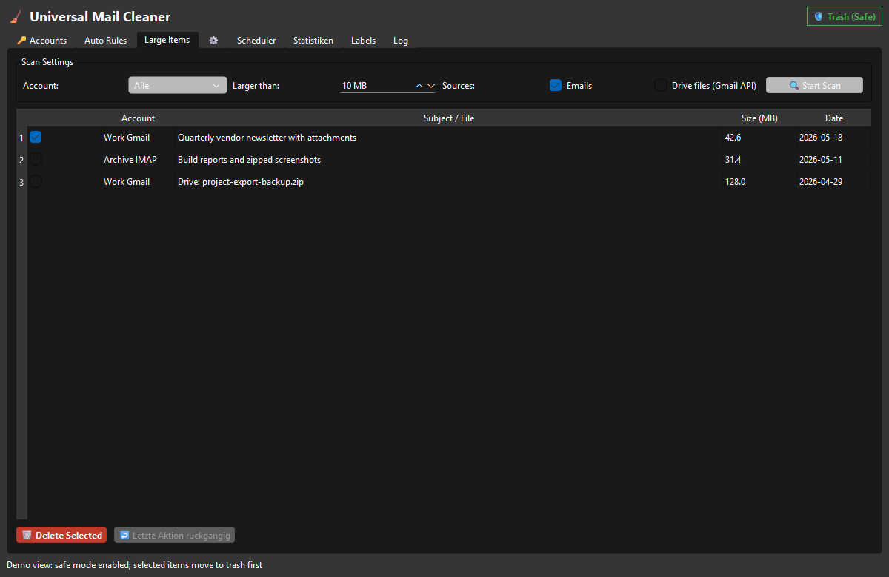

# UniversalMailCleaner

**🇬🇧 English** · **[🇩🇪 Deutsche Dokumentation](README-DE.md)**

> Local-first Windows desktop app for cleaning IMAP and Gmail mailboxes — rule-based cleanup, large-mail scans, scheduler, safe trash mode.

[](LICENSE)
[](CHANGELOG.md)
[](#start-here)
[](https://pypi.org/project/PySide6/)

UniversalMailCleaner combines rule-based email cleanup, large-mail and Drive scans, scheduler runs, safe trash mode, and undoable deletion workflows in one PySide6 interface.



## Why UniversalMailCleaner

UniversalMailCleaner is built for people who want to reduce mailbox storage and newsletter clutter without handing their inbox to another cloud service. It runs locally, keeps passwords out of the project config, supports standard IMAP providers, and can use the Gmail API when OAuth2 account features are needed.

## Start Here

| If you want to... | Start with |
|---|---|
| clean a Gmail inbox without a hosted cleanup service | Gmail API account, safe mode, and label-aware cleanup |
| reduce storage in a classic mailbox | IMAP account, large-item scanner, and trash-folder check |
| remove old newsletters or repetitive senders | rule filters for age, sender, subject, and folder |
| review related mail tools | [MailProcessor](https://github.com/doc-bricks/MailProcessor), [UniversalDocsGrabber](https://github.com/doc-bricks/UniversalDocsGrabber), and [UniversalInvoiceMail](https://github.com/doc-bricks/UniversalInvoiceMail) |

Use it for:

- Gmail mailbox cleanup with OAuth2 and label-aware actions
- IMAP email cleanup for GMX, Outlook, Gmail IMAP, and other SSL IMAP providers
- Large email and optional Google Drive file cleanup
- Scheduled safe-mode mailbox maintenance
- Local, privacy-conscious mail management on Windows

## Features

- Multi-account support for IMAP providers plus Gmail API via OAuth2
- Google client libraries are only loaded when a Gmail API account is
  authenticated, so IMAP-only setups can still start without the optional
  Gmail packages
- Secure password storage via `keyring` with session-only fallback
- Rule-based filters for age, sender, subject, and size
- Multi-folder support beyond INBOX-only processing
- Safe mode (trash) plus unsafe mode for permanent deletion
- Undo for safe-mode deletions
- Large-item scanner with tabular selection for Gmail, IMAP, and optional Drive cleanup
- Gmail-specific tabs for storage statistics and label-based cleanup
- Secrets-free profile export/import for rules, account metadata, and scheduler presets
- Configurable logging via `UMAIL_CLEANER_LOG_LEVEL`
- Modular architecture: `imap_client.py`, `models.py`, `workers.py`

## Discovery Keywords

`doc-bricks/UniversalMailCleaner`, `UniversalMailCleaner`, `gmail cleaner`, `gmail cleanup tool`, `imap cleaner`, `imap-cleaner`, `mailbox cleaner`, `mailbox cleanup`, `inbox cleanup`, `email cleanup`, `large email finder`, `gmail label cleanup`, `local-first email management`, `PySide6 desktop app`, `Windows email cleaner`, `safe delete email cleanup`

## Search and Disambiguation

UniversalMailCleaner is a desktop mailbox cleanup app, not an email marketing tool, CRM, hosted unsubscribe service, mailing-list validator, MailCleaner anti-spam gateway, or browser-only Gmail extension. The repository is best matched by searches for `doc-bricks/UniversalMailCleaner`, local-first Gmail cleanup, IMAP mailbox cleaner, large email finder for Windows, PySide6 email management app, safe trash mode mail cleanup, inbox cleanup without subscription, and Gmail label cleanup with undo support.

## Run

### Windows

Double-click `START.bat`

### Manual

```bash
pip install -e .
universalmailcleaner
```

Legacy alternative:

```bash
pip install -r requirements.txt
python mail_imap_cleaner_v1.py
```

## Typical Workflow

1. Add an IMAP account or a Gmail API account
2. Check or auto-detect the trash folder for IMAP accounts
3. Define a rule or use the large-item scanner
4. Enable Drive file scanning for Gmail API accounts if needed
5. Select the target folder for IMAP rule runs if needed
6. Execute in safe mode
7. Undo the last deletion if needed

## Configuration

- Config file: `%USERPROFILE%\.mail_cleaner\config.json`
- Passwords are not stored in the JSON file
- Safe mode is active by default

## Tests

```bash
pytest tests -v
```

## Safety

- IMAP uses encrypted connections (`IMAP4_SSL`)
- Safe mode moves mails to trash by default
- Undo available for all safe-mode actions
- Without `keyring`, passwords are held in the current session only

## Supported Providers

- GMX (`imap.gmx.net:993`)
- Gmail via IMAP (`imap.gmail.com:993`) with App Password
- Gmail via Gmail API account with OAuth2 (`credentials.json` required)
- Outlook (`outlook.office365.com:993`)
- Any IMAP4 provider with standard SSL

## FAQ

**Gmail login fails?**
For IMAP, enable two-factor authentication and create an App Password:
[myaccount.google.com/apppasswords](https://myaccount.google.com/apppasswords)

For Gmail API accounts, place `credentials.json` next to the application and complete the OAuth2 browser login.
The optional Google client packages are only required for this Gmail API path;
pure IMAP usage can still start without them.

If you upgrade from an older Gmail-only token and Drive cleanup stays unavailable, delete
`%LOCALAPPDATA%\\UniversalMailCleaner\\gmail_token.json` once and authenticate again so the new Drive scope can be granted.

**Keyring is missing?**
Install via `pip install keyring`.

**Trash folder not detected?**
Set it manually in the account dialog.

## Related Tools

Part of the [doc-bricks](https://github.com/doc-bricks) mail suite:

| Tool | Description |
|------|-------------|
| [MailProcessor](https://github.com/doc-bricks/MailProcessor) | System tray launcher for all Universal Mail Tools |
| [UniversalDocsGrabber](https://github.com/doc-bricks/UniversalDocsGrabber) | Download documents and attachments from IMAP mail |
| [UniversalInvoiceMail](https://github.com/doc-bricks/UniversalInvoiceMail) | Extract invoices and receipts from IMAP mail |

## License

[MIT](LICENSE)
