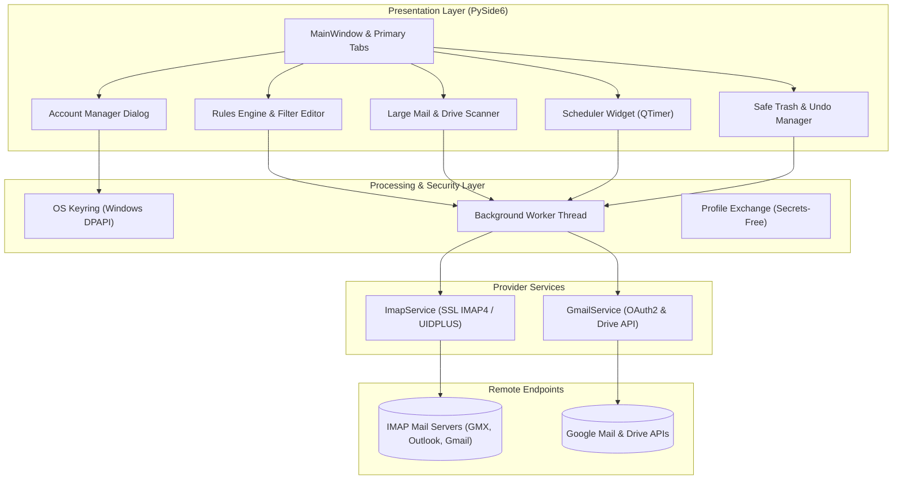
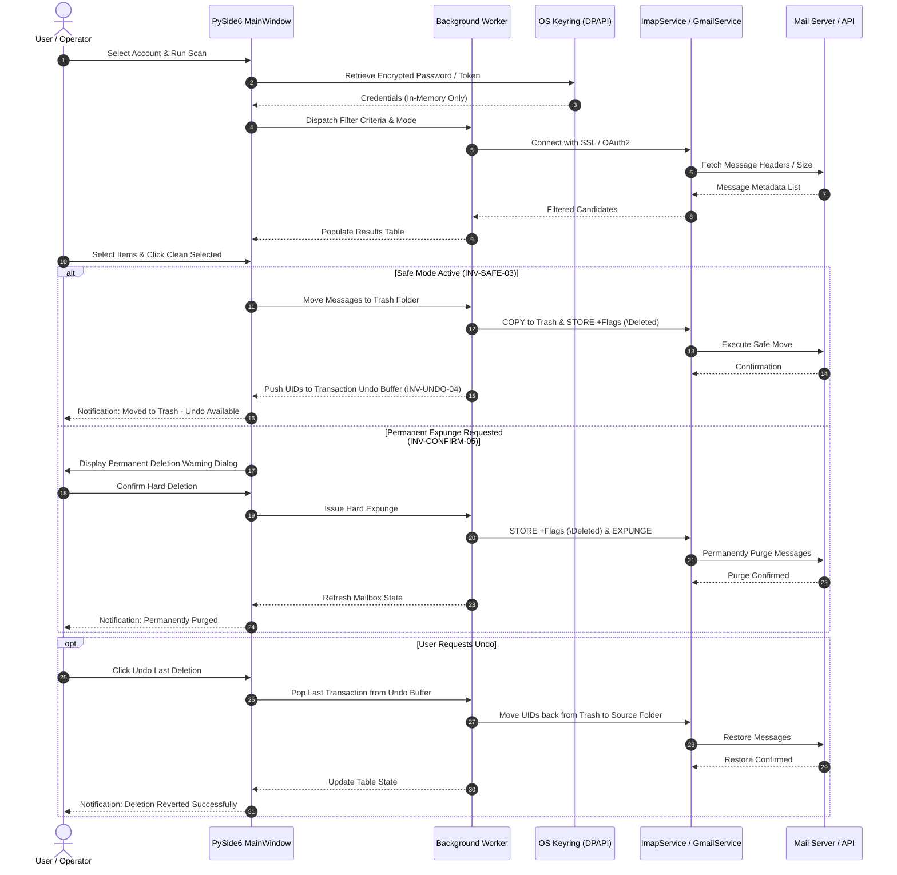

# UniversalMailCleaner

**🇬🇧 English** · **[🇩🇪 Deutsche Dokumentation](README_de.md)**

> Local-first Windows desktop app for cleaning IMAP and Gmail mailboxes — rule-based cleanup, large-mail scans, scheduler, and safe trash mode with undo.

[](LICENSE)
[](NOTICE)
[](CHANGELOG.md)
[](#quick-start--setup)
[](https://pypi.org/project/PySide6/)
[](pyproject.toml)
[](tests)
[](SECURITY.md)
[](https://github.com/doc-bricks)
[](https://github.com/open-bricks)
[](THIRD_PARTY_LICENSES.md)
[](MARKETING-LOG.txt)
[](llms.txt)

> [!NOTE]
> Machine-readable repository summary for AI agents and LLMs available at [`llms.txt`](llms.txt). Audit reports available in [`THIRD_PARTY_LICENSES.md`](THIRD_PARTY_LICENSES.md) and [`MARKETING-LOG.txt`](MARKETING-LOG.txt).

---

### 🧭 Quick Navigation

1. [Architecture & Design Principles](#sec-01)
2. [Workflow Lifecycle & State Machine](#sec-02)
3. [Visual Interface & Screenshot Showcase](#sec-03)
4. [Core Capabilities & Invariants](#sec-04)
5. [Feature Highlights & Safety Nets](#sec-05)
6. [Target Personas & Search Intent](#sec-06)
7. [Comparative Matrix vs. Alternatives](#sec-07)
8. [Runtime Invariants & Security Guarantees](#sec-08)
9. [Supported Providers & Protocols](#sec-09)
10. [Quick Start & Setup](#sec-10)
11. [Configuration & Credential Safety](#sec-11)
12. [Scheduler & Automated Maintenance](#sec-12)
13. [Testing, Verification & Quality Gates](#sec-13)
14. [Ecosystem & Sibling Tools](#sec-14)
15. [Third-Party Licenses & Level 1 SBOM](#sec-15)
16. [Marketing Strategy & Audience Journey](#sec-16)
17. [License & Attribution](#sec-17)
18. [Statutory Notice (§ 521 BGB) & Security SLA](#sec-18)

---

<a id="sec-01"></a><a id="architecture"></a><a id="architektur"></a>
## 1. 🏗️ Architecture & Design Principles

UniversalMailCleaner employs a layered desktop architecture designed for non-blocking UI responsiveness, zero credential leakage, and strict local execution boundaries.


```mermaid
flowchart TD
    subgraph UI["Presentation Layer (PySide6)"]
        MW["MainWindow & Primary Tabs"]
        AC["Account Manager Dialog"]
        RL["Rules Engine & Filter Editor"]
        LS["Large Mail & Drive Scanner"]
        SC["Scheduler Widget (QTimer)"]
        ST["Safe Trash & Undo Manager"]
    end

    subgraph Core["Processing & Security Layer"]
        KR["OS Keyring (Windows DPAPI)"]
        WK["Background Worker Thread"]
        PE["Profile Exchange (Secrets-Free)"]
    end

    subgraph Service["Provider Services"]
        IMAP["ImapService (SSL IMAP4 / UIDPLUS)"]
        GMAIL["GmailService (OAuth2 & Drive API)"]
    end

    subgraph Remote["Remote Endpoints"]
        SRV[("IMAP Mail Servers (GMX, Outlook, Gmail)")]
        GOOG[("Google Mail & Drive APIs")]
    end

    MW --> AC
    MW --> RL
    MW --> LS
    MW --> SC
    MW --> ST

    AC --> KR
    RL --> WK
    LS --> WK
    SC --> WK
    ST --> WK

    WK --> IMAP
    WK --> GMAIL

    IMAP --> SRV
    GMAIL --> GOOG
```

---

<a id="sec-02"></a><a id="workflow-lifecycle"></a><a id="workflow-lebenszyklus"></a>
## 2. 🔄 Workflow Lifecycle & State Machine

The following sequence details how UniversalMailCleaner isolates credentials, queries mail servers via background worker threads, routes safe-mode deletions to provider trash folders with instant undo guarantees, and requires explicit confirmation for permanent deletions:


```mermaid
sequenceDiagram
    autonumber
    actor User as User / Operator
    participant UI as PySide6 MainWindow
    participant Worker as Background Worker
    participant Keyring as OS Keyring (DPAPI)
    participant Service as ImapService / GmailService
    participant MailServer as Mail Server / API

    User->>UI: Select Account & Run Scan
    UI->>Keyring: Retrieve Encrypted Password / Token
    Keyring-->>UI: Credentials (In-Memory Only)
    UI->>Worker: Dispatch Filter Criteria & Mode
    Worker->>Service: Connect with SSL / OAuth2
    Service->>MailServer: Fetch Message Headers / Size
    MailServer-->>Service: Message Metadata List
    Service-->>Worker: Filtered Candidates
    Worker-->>UI: Populate Results Table

    User->>UI: Select Items & Click Clean Selected
    alt Safe Mode Active (INV-SAFE-03)
        UI->>Worker: Move Messages to Trash Folder
        Worker->>Service: COPY to Trash & STORE +Flags (\Deleted)
        Service->>MailServer: Execute Safe Move
        MailServer-->>Service: Confirmation
        Worker-->>UI: Push UIDs to Transaction Undo Buffer (INV-UNDO-04)
        UI-->>User: Notification: Moved to Trash - Undo Available
    else Permanent Expunge Requested (INV-CONFIRM-05)
        UI->>User: Display Permanent Deletion Warning Dialog
        User->>UI: Confirm Hard Deletion
        UI->>Worker: Issue Hard Expunge
        Worker->>Service: STORE +Flags (\Deleted) & EXPUNGE
        Service->>MailServer: Permanently Purge Messages
        MailServer-->>Service: Purge Confirmed
        Worker-->>UI: Refresh Mailbox State
        UI-->>User: Notification: Permanently Purged
    end

    opt User Requests Undo
        User->>UI: Click Undo Last Deletion
        UI->>Worker: Pop Last Transaction from Undo Buffer
        Worker->>Service: Move UIDs back from Trash to Source Folder
        Service->>MailServer: Restore Messages
        MailServer-->>Service: Restore Confirmed
        Worker-->>UI: Update Table State
        UI-->>User: Notification: Deletion Reverted Successfully
    end
```

---

<a id="sec-03"></a><a id="visual-interface--screenshot"></a><a id="visuelle-oberflaeche--screenshot"></a>
## 3. 🖥️ Visual Interface & Screenshot Showcase

UniversalMailCleaner provides an intuitive PySide6 desktop interface organizing accounts, rule builders, large-item scanners, scheduler presets, and undo capabilities:


---

<a id="sec-04"></a><a id="core-capabilities--security-invariants"></a><a id="kernfaehigkeiten--sicherheitsinvarianten"></a>
## 4. 🛡️ Core Capabilities & Invariants

UniversalMailCleaner is built around 10 verifiable security, architectural, and operational invariants:

| Invariant Code | Category | Name & Guarantee | Verification Boundary |
|---|---|---|---|
| `INV-LOCAL-01` | Architecture | **100% Local-First Execution** | All mailbox processing, filtering rules, and cache files remain entirely local; zero external telemetry or cloud analytics. |
| `INV-CRED-02` | Security | **Encrypted Credential Isolation** | Account passwords and tokens are held via `keyring` in the OS Credential Manager (Windows DPAPI) or session memory; never stored in plaintext `config.json`. |
| `INV-SAFE-03` | Safety | **Safe-by-Default Deletion** | Default operational mode routes all deletions to the provider's trash folder (`Trash`, `Papierkorb`, `[Gmail]/Trash`) rather than issuing immediate expunge commands. |
| `INV-UNDO-04` | Transaction | **Transactional Undo Capability** | Safe-mode deletions register message UIDs and folder mappings into an in-memory undo buffer, allowing immediate single-click restoration. |
| `INV-CONFIRM-05` | Safety | **Explicit Hard-Delete Opt-In** | Permanent purge (`EXPUNGE`) requires explicit user confirmation via dialog modal with safety warnings. |
| `INV-TLS-06` | Network | **Enforced TLS Transport Security** | Network communication strictly requires `IMAP4_SSL` (port 993) and TLS 1.3 / HTTPS for Google APIs; unencrypted plaintext transport is rejected. |
| `INV-LEASTPRIV-07` | Permission | **Least-Privilege OAuth2 Scopes** | Google OAuth2 asks only for minimal required scopes (`gmail.modify`, optional `drive.file` / `drive.metadata.readonly`); no administrative takeovers. |
| `INV-LAZYLOAD-08` | Runtime | **Lazy Optional Dependency Boundary** | Google client libraries (`google-api-python-client`, `google-auth-oauthlib`) are loaded lazily on demand; IMAP-only users start with zero Google library overhead. |
| `INV-PORTABLE-09` | Portability | **Secrets-Free Profile Portability** | Exported rule profiles (`profile_exchange.py`) strip all credentials and secrets, enabling safe cross-machine sharing and version-control storage. |
| `INV-SLA-10` | Governance | **48h Security SLA & 5-Day Triage** | Documented response timeline in `SECURITY.md` committing to 48-hour response and 5-day triage for all reported security vulnerabilities. |

---

<a id="sec-05"></a><a id="feature-highlights"></a><a id="funktions-highlights"></a>
## 5. ⚡ Feature Highlights & Safety Nets

- **Multi-Account Management:** Simultaneous configuration of SSL IMAP accounts (GMX, Outlook, Web.de, custom mail servers) and Gmail API OAuth2 profiles.
- **Lazy Google API Integration:** Google client packages are loaded dynamically only when authenticating a Gmail API account. Pure IMAP setups run without Google library dependencies.
- **Hardware-Backed Credential Security:** Passwords stored in Windows Credential Manager via `keyring` (Windows DPAPI), falling back to session-only RAM storage if the keyring service is unavailable.
- **Rule-Based Filtering Engine:** Create composite rules based on age (e.g. older than 90 days), sender pattern, subject keyword, and minimum file/message size.
- **Safe Mode by Default:** All deletion actions move messages to the provider's trash folder rather than expunging them immediately (`INV-SAFE-03`).
- **Transactional Undo:** Instantly restore the previous batch of safe-mode deleted messages with message UID verification (`INV-UNDO-04`).
- **Large-Item Scanner:** Tabular overview of heaviest emails and optional Google Drive files, sorted by size with direct selection for cleaning.
- **Gmail Storage & Label Analytics:** Real-time quota metrics, label-specific cleanup tabs, and selective trash purging.
- **Secrets-Free Profile Portability:** Export and import cleanup rules and account templates across machines without exposing credentials (`INV-PORTABLE-09`).
- **Configurable Logging:** Adjust verbosity via the `UMAIL_CLEANER_LOG_LEVEL` environment variable.

---

<a id="sec-06"></a><a id="target-personas--use-cases"></a><a id="zielgruppen--anwendungsfaelle"></a>
## 6. 🎯 Target Personas & Search Intent

UniversalMailCleaner is engineered to solve acute pain points for four defined user personas:

### `[PERSONA-01]` Privacy-Conscious Professionals & Compliance Officers
- **Search Queries:** `"local email cleaner privacy first"`, `"gdpr compliant imap cleaner"`, `"clean mailbox without cloud service"`
- **Pain Point:** Cannot risk transmitting client data, medical correspondence, or internal memos through cloud SaaS cleanup vendors that monetize email metadata.
- **Solution:** 100% Local-First desktop execution (`INV-LOCAL-01`), Zero-Egress design, and hardware-encrypted credential vaults (`INV-CRED-02`).

### `[PERSONA-02]` Storage-Constrained Gmail & IMAP Users
- **Search Queries:** `"free up gmail storage without paying"`, `"find large emails fast windows"`, `"clean google drive storage quota"`
- **Pain Point:** Facing imminent 15 GB shared Google quota limits or corporate IMAP mailbox caps, prompting forced monthly cloud subscriptions.
- **Solution:** High-speed tabular large-item scanner filtering heavy attachments (>10MB, >25MB) across mail and Google Drive for precise reclamation.

### `[PERSONA-03]` Power Users & Digital Minimalists
- **Search Queries:** `"automate imap inbox cleanup"`, `"desktop email rules scheduler"`, `"safe trash mail cleaner with undo"`
- **Pain Point:** Overwhelmed by tens of thousands of marketing newsletters, automated alerts, and stale notifications across multiple accounts.
- **Solution:** Automated recurring background scheduler (`QTimer`), multi-criteria rule chaining, and instantaneous transactional rollback (`INV-UNDO-04`).

### `[PERSONA-04]` Solo Developers & System Administrators
- **Search Queries:** `"open source python imap cleaner"`, `"pyside6 mail management tool"`, `"self hosted email retention cleaner"`
- **Pain Point:** Frustrated by bloated proprietary tools with recurring subscriptions, broken IMAP protocol implementations, and hidden telemetry.
- **Solution:** Permissive MIT-licensed Python codebase, modular testsuite with 103+ unit tests, and secrets-free portable rule profiles (`INV-PORTABLE-09`).

---

<a id="sec-07"></a><a id="comparative-matrix--alternatives"></a><a id="vergleichsmatrix--alternativen"></a>
## 7. ⚖️ Comparative Matrix vs. Alternatives

| Technical Dimension | UniversalMailCleaner | Cloud SaaS (Cleanfox / Unroll.me) | Paid Sweepers (Mailstrom / SaneBox) | Native Clients (Thunderbird / Outlook) | Custom Shell Scripts (Python / curl) |
|---|---|---|---|---|---|
| **Local-First Zero-Egress** (`INV-LOCAL-01`) | **100% Local Desktop** | Cloud Server Intermediary | Cloud Server Polling | Local / Cloud Client | Local Shell |
| **Credential Security** (`INV-CRED-02`) | **Windows DPAPI Vault** | Cloud OAuth / Tokens Stored | Stored Cloud Credentials | Local profile file | Plaintext or Environment |
| **Safe Trash Mode** (`INV-SAFE-03`) | **Standard Default** | Trash / Unsubscribe link | Trash / Custom folder | Manual trash move | Hard EXPUNGE danger |
| **Transactional Undo** (`INV-UNDO-04`) | **1-Click UID Rollback** | None | Limited session undo | None / Manual drag | Irreversible |
| **Purge Confirmation** (`INV-CONFIRM-05`) | **Mandatory Dialog** | Instant hard delete | Instant hard delete | Settings-dependent | No guard |
| **Enforced TLS 1.3** (`INV-TLS-06`) | **Strict IMAP4_SSL:993** | Provider standard | Provider standard | Optional configuration | Script-dependent |
| **Minimal OAuth Scope** (`INV-LEASTPRIV-07`) | **gmail.modify only** | Full mailbox read/write | Full account access | Full client access | API key or token |
| **Lazy Loading** (`INV-LAZYLOAD-08`) | **Dynamic Google imports** | Heavy cloud backend | Heavy cloud backend | Monolithic application | Bare script |
| **Secrets-Free Profiles** (`INV-PORTABLE-09`) | **Built-in Export/Import** | Proprietary cloud sync | Cloud account locking | Manual profile copy | None |
| **Vulnerability SLA** (`INV-SLA-10`) | **48h / 5d Public SLA** | Undisclosed | Standard commercial | Open bug tracker | None |

---

<a id="sec-08"></a><a id="runtime-invariants--security-guarantees"></a><a id="laufzeit-invarianten--sicherheitsgarantien"></a>
## 8. 🔒 Runtime Invariants & Security Guarantees

UniversalMailCleaner guarantees uncompromised runtime hygiene:
- **No Telemetry, No Analytics:** Zero tracking beacons, crash report uploaders, or usage analytics are compiled into the binary or scripts.
- **Fail-Closed Lock Defense:** The application respects local locks and performs non-destructive read operations whenever file conflicts are detected.
- **Memory-Isolated Credentials:** Passwords decrypted from the Windows DPAPI Credential Vault remain strictly ephemeral in RAM and are scrubbed upon disconnect.

---

<a id="sec-09"></a><a id="supported-providers"></a><a id="unterstuetzte-anbieter"></a>
## 9. 🌐 Supported Providers & Protocols

- **GMX:** `imap.gmx.net:993` with SSL
- **Outlook / Office 365:** `outlook.office365.com:993` with SSL
- **Gmail via IMAP:** `imap.gmail.com:993` with App Password
- **Gmail via Gmail API:** OAuth2 authentication (`credentials.json` required)
- **Web.de:** `imap.web.de:993` with SSL
- **Generic IMAP:** Any RFC 3501 compliant IMAP4 server supporting SSL/TLS on port 993

---

<a id="sec-10"></a><a id="quick-start--setup"></a><a id="schnellstart--installation"></a>
## 10. 🚀 Quick Start & Setup

### Windows Launcher
Double-click `START.bat` in the repository root to launch the desktop application.

### Installation via pip
```bash
# Clone repository
git clone https://github.com/doc-bricks/UniversalMailCleaner.git
cd UniversalMailCleaner

# Install in editable mode
pip install -e .

# Launch application
universalmailcleaner
```

### Direct Script Execution
```bash
pip install -r requirements.txt
python mail_imap_cleaner_v1.py
```

---

<a id="sec-11"></a><a id="configuration--credential-safety"></a><a id="konfiguration--zugangsdaten-sicherheit"></a>
## 11. ⚙️ Configuration & Credential Safety

- **Configuration File:** Stored at `%USERPROFILE%\.mail_cleaner\config.json`.
- **Zero Plaintext Passwords:** Credentials and OAuth tokens are strictly decoupled from the JSON configuration and stored securely in Windows Credential Manager (`INV-CRED-02`).
- **Safe Mode Enforced:** Safe mode is activated by default on every startup (`INV-SAFE-03`).

---

<a id="sec-12"></a><a id="scheduler--automated-maintenance"></a><a id="zeitplaner--automatisierte-wartung"></a>
## 12. ⏰ Scheduler & Automated Maintenance

UniversalMailCleaner includes an integrated `scheduler_widget.py` component driven by Qt's high-precision `QTimer`:
- Run rule sets automatically at configurable intervals (e.g. every 6 hours, daily, weekly).
- Scheduled operations run strictly in safe mode to prevent unattended data loss.
- Status logs and last-run timestamps are displayed directly in the scheduler status panel.

---

<a id="sec-13"></a><a id="testing--verification"></a><a id="testen--qualitaets-gates"></a>
## 13. 🧪 Testing, Verification & Quality Gates

The test suite validates UI components, background workers, credential vaults, and metadata integrity:

```bash
# Run complete test suite (103+ unit tests)
pytest tests -v

# Run metadata and contract tests
pytest tests/test_metadata.py -v

# Code quality and style audit
ruff check .
```

---

<a id="sec-14"></a><a id="ecosystem--sibling-tools"></a><a id="oekosystem--geschwister-werkzeuge"></a>
## 14. 🧱 Ecosystem & Sibling Tools

UniversalMailCleaner is a core utility in the **doc-bricks** document and mailbox productivity suite under the **open-bricks** ecosystem:

| Tool | Focus & Purpose | Status |
|---|---|---|
| [MailProcessor](https://github.com/doc-bricks/MailProcessor) | System tray launcher and orchestrator for all Universal Mail Tools | Production |
| [UniversalDocsGrabber](https://github.com/doc-bricks/UniversalDocsGrabber) | Rule-based attachment and document extraction from IMAP mailboxes | Production |
| [UniversalInvoiceMail](https://github.com/doc-bricks/UniversalInvoiceMail) | Automated invoice and receipt retrieval and sorting from email | Production |
| [DokuZen](https://github.com/doc-bricks/DokuZen) | Local document and PDF management suite (22 tools in PySide6) | Production |
| [PDFtoPDFocr](https://github.com/doc-bricks/PDFtoPDFocr) | Optical character recognition (OCR) desktop app for scanned PDFs | Production |
| [MediaBrain](https://github.com/doc-bricks/MediaBrain) | Multi-format media and document metadata analyzer and converter | Production |
| [ProFiler](https://github.com/file-bricks/ProFiler) | Fast desktop file management, organization, and batch workflow tool | Production |

---

<a id="sec-15"></a><a id="third-party-licenses--compliance"></a><a id="drittanbieter-lizenzen--compliance"></a>
## 15. 📜 Third-Party Licenses & Level 1 SBOM

All third-party dependencies are cataloged in [`THIRD_PARTY_LICENSES.md`](THIRD_PARTY_LICENSES.md):
- **PySide6:** Qt for Python GUI toolkit (`LGPL-3.0-only`). Dynamically linked without copyleft contagion.
- **keyring:** Windows DPAPI credential storage (`MIT`).
- **google-auth-oauthlib & google-api-python-client:** Permissive (`Apache-2.0`). Loaded lazily on demand.
- **Level 1 SBOM:** Direct and transitive dependencies, SPDX license IDs, upstream repositories, and verification boundaries are audited under Section 7 of [`THIRD_PARTY_LICENSES.md`](THIRD_PARTY_LICENSES.md).

---

<a id="sec-16"></a><a id="marketing-strategy--audience-journey"></a><a id="marketing-strategie--zielgruppen-journey"></a>
## 16. 📈 Marketing Strategy & Audience Journey

UniversalMailCleaner follows the transparent discoverability framework defined in `MARKETING-LOG.txt`:
1. **Awareness:** Search intent targeting privacy-conscious users seeking GDPR-compliant email cleaners without cloud data harvesting.
2. **Evaluation:** Detailed 10-dimension comparative matrix contrasting local execution with commercial cloud aggregators.
3. **Activation:** Effortless zero-install start via `START.bat` or single-command pip installation.
4. **Retention:** Background scheduler automation and secrets-free portable rule profiles for team and multi-device deployment.

---

<a id="sec-17"></a><a id="license--attribution"></a><a id="license--faq"></a><a id="lizenz--urheberrecht"></a>
## 17. 📄 License & Attribution

UniversalMailCleaner is open-source software licensed under the **[MIT License](LICENSE)**.

Copyright (c) 2026 Lukas Geiger. All rights reserved.<br>
Maintained by **doc-bricks** under the umbrella of **open-bricks**.<br>
Canonical attribution and notices are declared in the root [`NOTICE`](NOTICE) file.

---

<a id="sec-18"></a><a id="security-policy--slas"></a><a id="sicherheitsrichtlinie--slas"></a><a id="statutory-notice--bgb-sla"></a><a id="gesetzlicher-hinweis--bgb-sla"></a>
## 18. ⚖️ Statutory Notice (§ 521 BGB) & Security Response SLA

### Statutory Notice (§ 521 BGB Gefälligkeitsrecht)
Diese Software wird unentgeltlich und im Sinne des deutschen Gefälligkeitsrechts (§ 521 BGB) bereitgestellt. Die Haftung des Autors ist auf Vorsatz und grobe Fahrlässigkeit beschränkt. Die Nutzung erfolgt auf eigenes Risiko, insbesondere hinsichtlich der endgültigen Löschung von E-Mails im Permanent-Delete-Modus.

### 48-Hour Security Response SLA
We commit to acknowledging all vulnerability and security reports within **48 hours** and providing an initial triage classification within **5 business days** per [`SECURITY.md`](SECURITY.md).
