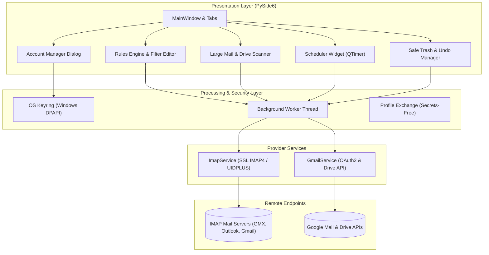
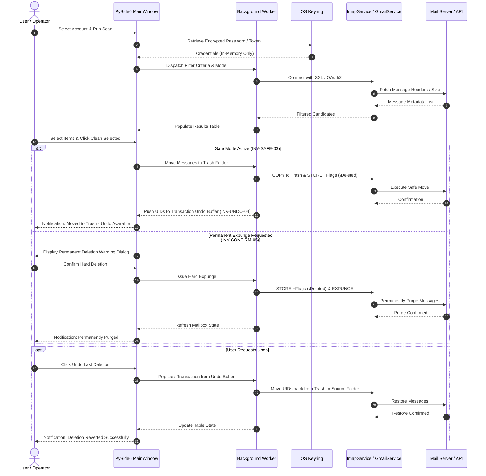

# UniversalMailCleaner

**🇬🇧 English** · **[🇩🇪 Deutsche Dokumentation](README_de.md)**

> Local-first Windows desktop app for cleaning IMAP and Gmail mailboxes — rule-based cleanup, large-mail scans, scheduler, and safe trash mode with undo.

[](LICENSE)
[](CHANGELOG.md)
[](#quick-start--setup)
[](https://pypi.org/project/PySide6/)
[](pyproject.toml)
[](tests)
[](SECURITY.md)
[](https://github.com/doc-bricks)
[](https://github.com/open-bricks)
[](llms.txt)

> [!NOTE]
> Machine-readable repository summary for AI agents and LLMs available at [`llms.txt`](llms.txt). Audit reports available in [`THIRD_PARTY_LICENSES.md`](THIRD_PARTY_LICENSES.md) and [`MARKETING-LOG.txt`](MARKETING-LOG.txt).

---

### Quick Navigation

- [1. Architecture](#architecture)
- [2. Workflow Lifecycle](#workflow-lifecycle)
- [3. Core Capabilities & Security Invariants](#core-capabilities--security-invariants)
- [4. Target Personas & Use Cases](#target-personas--use-cases)
- [5. Comparative Matrix & Alternatives](#comparative-matrix--alternatives)
- [6. Feature Highlights](#feature-highlights)
- [7. Visual Interface & Screenshot](#visual-interface--screenshot)
- [8. Supported Providers](#supported-providers)
- [9. Quick Start & Setup](#quick-start--setup)
- [10. Configuration & Credential Safety](#configuration--credential-safety)
- [11. Scheduler & Automated Maintenance](#scheduler--automated-maintenance)
- [12. Ecosystem & Sibling Tools](#ecosystem--sibling-tools)
- [13. Third-Party Licenses & Compliance](#third-party-licenses--compliance)
- [14. Security Policy & SLAs](#security-policy--slas)
- [15. License & FAQ](#license--faq)

---

## Architecture

UniversalMailCleaner employs a layered desktop architecture designed for non-blocking UI responsiveness, zero credential leakage, and strict local execution boundaries.


```mermaid
flowchart TD
    subgraph UI["Presentation Layer (PySide6)"]
        MW["MainWindow & Tabs"]
        AC["Account Manager Dialog"]
        RL["Rules Engine & Filter Editor"]
        LS["Large Mail & Drive Scanner"]
        SC["Scheduler Widget (QTimer)"]
        ST["Safe Trash & Undo Manager"]
    end

    subgraph Core["Processing & Security Layer"]
        KR["OS Keyring (Windows DPAPI)"]
        WK["Background Worker Thread"]
        PE["Profile Exchange (Secrets-Free)"]
    end

    subgraph Service["Provider Services"]
        IMAP["ImapService (SSL IMAP4 / UIDPLUS)"]
        GMAIL["GmailService (OAuth2 & Drive API)"]
    end

    subgraph Remote["Remote Endpoints"]
        SRV[("IMAP Mail Servers (GMX, Outlook, Gmail)")]
        GOOG[("Google Mail & Drive APIs")]
    end

    MW --> AC
    MW --> RL
    MW --> LS
    MW --> SC
    MW --> ST

    AC --> KR
    RL --> WK
    LS --> WK
    SC --> WK
    ST --> WK

    WK --> IMAP
    WK --> GMAIL

    IMAP --> SRV
    GMAIL --> GOOG
```

---

## Workflow Lifecycle

The following sequence details how UniversalMailCleaner isolates credentials, queries mail servers via background threads, handles safe-mode trash relocations with undo guarantees, and requires explicit confirmation for permanent deletions:


```mermaid
sequenceDiagram
    autonumber
    actor User as User / Operator
    participant UI as PySide6 MainWindow
    participant Worker as Background Worker
    participant Keyring as OS Keyring
    participant Service as ImapService / GmailService
    participant MailServer as Mail Server / API

    User->>UI: Select Account & Run Scan
    UI->>Keyring: Retrieve Encrypted Password / Token
    Keyring-->>UI: Credentials (In-Memory Only)
    UI->>Worker: Dispatch Filter Criteria & Mode
    Worker->>Service: Connect with SSL / OAuth2
    Service->>MailServer: Fetch Message Headers / Size
    MailServer-->>Service: Message Metadata List
    Service-->>Worker: Filtered Candidates
    Worker-->>UI: Populate Results Table

    User->>UI: Select Items & Click Clean Selected
    alt Safe Mode Active (INV-SAFE-03)
        UI->>Worker: Move Messages to Trash Folder
        Worker->>Service: COPY to Trash & STORE +Flags (\Deleted)
        Service->>MailServer: Execute Safe Move
        MailServer-->>Service: Confirmation
        Worker-->>UI: Push UIDs to Transaction Undo Buffer (INV-UNDO-04)
        UI-->>User: Notification: Moved to Trash - Undo Available
    else Permanent Expunge Requested (INV-CONFIRM-05)
        UI->>User: Display Permanent Deletion Warning Dialog
        User->>UI: Confirm Hard Deletion
        UI->>Worker: Issue Hard Expunge
        Worker->>Service: STORE +Flags (\Deleted) & EXPUNGE
        Service->>MailServer: Permanently Purge Messages
        MailServer-->>Service: Purge Confirmed
        Worker-->>UI: Refresh Mailbox State
        UI-->>User: Notification: Permanently Purged
    end

    opt User Requests Undo
        User->>UI: Click Undo Last Deletion
        UI->>Worker: Pop Last Transaction from Undo Buffer
        Worker->>Service: Move UIDs back from Trash to Source Folder
        Service->>MailServer: Restore Messages
        MailServer-->>Service: Restore Confirmed
        Worker-->>UI: Update Table State
        UI-->>User: Notification: Deletion Reverted Successfully
    end
```

---

## Core Capabilities & Security Invariants

UniversalMailCleaner is built around 10 verifiable security, architectural, and operational invariants:

| Invariant Code | Category | Name & Guarantee | Verification Boundary |
|---|---|---|---|
| `INV-LOCAL-01` | Architecture | **100% Local-First Execution** | All mailbox processing, filtering rules, and cache files remain entirely local; zero external telemetry or cloud analytics. |
| `INV-CRED-02` | Security | **Encrypted Credential Isolation** | Account passwords and tokens are held via `keyring` in the OS Credential Manager (Windows DPAPI) or session memory; never stored in plaintext `config.json`. |
| `INV-SAFE-03` | Safety | **Safe-by-Default Deletion** | Default operational mode routes all deletions to the provider's trash folder (`Trash`, `Papierkorb`, `[Gmail]/Trash`) rather than issuing immediate expunge commands. |
| `INV-UNDO-04` | Transaction | **Transactional Undo Capability** | Safe-mode deletions register message UIDs and folder mappings into an in-memory undo buffer, allowing immediate single-click restoration. |
| `INV-CONFIRM-05` | Safety | **Explicit Hard-Delete Opt-In** | Permanent purge (`EXPUNGE`) requires explicit user confirmation via dialog modal with safety warnings. |
| `INV-TLS-06` | Network | **Enforced TLS Transport Security** | Network communication strictly requires `IMAP4_SSL` (port 993) and TLS 1.3 / HTTPS for Google APIs; unencrypted plaintext transport is rejected. |
| `INV-LEASTPRIV-07` | Permission | **Least-Privilege OAuth2 Scopes** | Google OAuth2 asks only for minimal required scopes (`gmail.modify`, optional `drive.file` / `drive.metadata.readonly`); no administrative takeovers. |
| `INV-LAZYLOAD-08` | Runtime | **Lazy Optional Dependency Boundary** | Google client libraries (`google-api-python-client`, `google-auth-oauthlib`) are loaded lazily on demand; IMAP-only users start with zero Google library overhead. |
| `INV-PORTABLE-09` | Portability | **Secrets-Free Profile Portability** | Exported rule profiles (`profile_exchange.py`) strip all credentials and secrets, enabling safe cross-machine sharing and version-control storage. |
| `INV-SLA-10` | Governance | **48h Security SLA & 5-Day Triage** | Documented response timeline in `SECURITY.md` committing to 48-hour response and 5-day triage for all reported security vulnerabilities. |

---

## Target Personas & Use Cases

UniversalMailCleaner serves four core user personas requiring granular control over mailbox maintenance:

1. **Privacy-Conscious Professionals & GDPR Officers**
   - *Problem:* Need inbox hygiene, automated retention compliance, and newsletter purges without transmitting client communications or internal emails through third-party cloud aggregators.
   - *Solution:* 100% Local-First Execution (`INV-LOCAL-01`) with zero telemetry, unprivileged desktop operation, and encrypted OS credential storage.
2. **Storage-Constrained Gmail & IMAP Account Holders**
   - *Problem:* Hitting storage ceilings on Gmail (15GB shared quota) or corporate IMAP accounts; faced with expensive recurring cloud storage tier upgrades.
   - *Solution:* Tabular multi-criteria scanner for large emails and Google Drive files, liberating gigabytes locally with precise sender and date filters.
3. **Power Users & Digital Minimalists**
   - *Problem:* Managing multiple inboxes (GMX, Outlook, Gmail, Web.de) cluttered with tens of thousands of automated notifications and marketing blasts.
   - *Solution:* Unified account switching, automated background scheduler intervals, and safe trash mode with single-click undo safety nets.
4. **Solo Developers & System Administrators**
   - *Problem:* Commercial mailbox cleanup tools are subscription traps that harvest email metadata, monetize unsubscribe lead lists, or break IMAP protocols.
   - *Solution:* Free, open-source MIT Python desktop utility with auditable code, lazy dependency boundaries, and portable secrets-free profile exchange.

---

## Comparative Matrix & Alternatives

| Dimension | UniversalMailCleaner | Cloud Mailbox Cleaners (Cleanfox/Unroll.me) | Commercial Aggregators (Mailstrom/SaneBox) | Webmail / Native Clients (Thunderbird/Gmail) | Ad-Hoc Scripts (Python/Bash) |
|---|---|---|---|---|---|
| **Architecture & Privacy** | **100% Local Desktop (Zero-Egress)** | Cloud Backend Processing | Cloud SaaS Polling | Local / Cloud Client | Local CLI Script |
| **Email Body & Metadata** | **Processed strictly on-device** | Harvested on vendor servers | Stored in vendor cloud | Provider-managed | Local terminal |
| **Data Monetization** | **Zero (MIT Open Source)** | Aggregated & sold for marketing | Paid subscription lock-in | Ecosystem tracking | None |
| **Safe Mode & Undo** | **Safe Trash + 1-Click Undo** | Trash only / Unsubscribe | Trash only | Manual move / Undo send only | Hard EXPUNGE risk |
| **Credential Security** | **OS Keyring (Windows DPAPI)** | Cloud OAuth / Stored credentials | Cloud IMAP / OAuth stored | Native credential cache | Plaintext / Env vars |
| **Automated Scheduler** | **Local QTimer Scheduler** | Cloud background polling | Scheduled cloud sweeps | Server rules (limited) | OS Cron / TaskScheduler |
| **Large-Item Discovery** | **Tabular Multi-Source (Mail+Drive)** | Sender-level summaries | Category-based bundling | Search query bar | Custom IMAP query |
| **Cost & Licensing** | **100% Free & Open Source (MIT)** | "Free" with data harvesting | $9 - $30 / month | Free with account | Free |
| **Dependency Isolation** | **Standalone + Lazy Google loading** | Hosted service | Hosted service | Heavy native app | Python stdlib |
| **Sibling Ecosystem** | **doc-bricks & open-bricks** | Proprietary silo | Proprietary silo | Vendor silo | Isolated |

---

## Feature Highlights

- **Multi-Account Management:** Simultaneous configuration of SSL IMAP accounts (GMX, Outlook, Web.de, custom mail servers) and Gmail API OAuth2 profiles.
- **Lazy Google API Integration:** Google client packages are loaded dynamically only when authenticating a Gmail API account. Pure IMAP setups run without Google library dependencies.
- **Hardware-Backed Credential Security:** Passwords stored in Windows Credential Manager via `keyring`, falling back to session-only RAM storage if the keyring service is unavailable.
- **Rule-Based Filtering Engine:** Create composite rules based on age (e.g. older than 90 days), sender pattern, subject keyword, and minimum file/message size.
- **Safe Mode by Default:** All deletion actions move messages to the provider's trash folder rather than expunging them immediately.
- **Transactional Undo:** Instantly restore the previous batch of safe-mode deleted messages with message UID verification.
- **Large-Item Scanner:** Tabular overview of heaviest emails and optional Google Drive files, sorted by size with direct selection for cleaning.
- **Gmail Storage & Label Analytics:** Real-time quota metrics, label-specific cleanup tabs, and selective trash purging.
- **Secrets-Free Profile Portability:** Export and import cleanup rules and account templates across machines without exposing credentials.
- **Configurable Logging:** Adjust verbosity via the `UMAIL_CLEANER_LOG_LEVEL` environment variable.

---

## Visual Interface & Screenshot

UniversalMailCleaner provides an intuitive PySide6 interface organizing accounts, rule builders, large-item scanners, scheduler presets, and undo capabilities:


---

## Supported Providers

- **GMX:** `imap.gmx.net:993` with SSL
- **Outlook / Office 365:** `outlook.office365.com:993` with SSL
- **Gmail via IMAP:** `imap.gmail.com:993` with App Password
- **Gmail via Gmail API:** OAuth2 authentication (`credentials.json` required)
- **Web.de:** `imap.web.de:993` with SSL
- **Generic IMAP:** Any RFC 3501 compliant IMAP4 server supporting SSL/TLS on port 993

---

## Quick Start & Setup

### Windows Launcher

Double-click `START.bat` in the repository root to launch the desktop application.

### Installation via pip

```bash
# Clone repository
git clone https://github.com/doc-bricks/UniversalMailCleaner.git
cd UniversalMailCleaner

# Install in editable mode
pip install -e .

# Launch application
universalmailcleaner
```

### Direct Script Execution

```bash
pip install -r requirements.txt
python mail_imap_cleaner_v1.py
```

### Running Tests

```bash
pytest tests -v
```

---

## Configuration & Credential Safety

- **Configuration File:** Stored at `%USERPROFILE%\.mail_cleaner\config.json`.
- **Zero Plaintext Passwords:** Credentials and OAuth tokens are strictly decoupled from the JSON configuration and stored securely in Windows Credential Manager (`INV-CRED-02`).
- **Safe Mode Enforced:** Safe mode is activated by default on every startup (`INV-SAFE-03`).

---

## Scheduler & Automated Maintenance

UniversalMailCleaner includes an integrated `scheduler_widget.py` component driven by Qt's high-precision `QTimer`:
- Run rule sets automatically at configurable intervals (e.g. every 6 hours, daily, weekly).
- Scheduled operations run strictly in safe mode to prevent unattended data loss.
- Status logs and last-run timestamps are displayed directly in the scheduler status panel.

---

## Ecosystem & Sibling Tools

UniversalMailCleaner is a core utility in the **doc-bricks** document and mailbox productivity suite under the **open-bricks** ecosystem:

| Tool | Focus & Purpose | Status |
|---|---|---|
| [MailProcessor](https://github.com/doc-bricks/MailProcessor) | System tray launcher and orchestrator for all Universal Mail Tools | Production |
| [UniversalDocsGrabber](https://github.com/doc-bricks/UniversalDocsGrabber) | Rule-based attachment and document extraction from IMAP mailboxes | Production |
| [UniversalInvoiceMail](https://github.com/doc-bricks/UniversalInvoiceMail) | Automated invoice and receipt retrieval and sorting from email | Production |
| [DokuZen](https://github.com/doc-bricks/DokuZen) | Local document and PDF management suite (22 tools in PySide6) | Production |
| [PDFtoPDFocr](https://github.com/doc-bricks/PDFtoPDFocr) | Optical character recognition (OCR) desktop app for scanned PDFs | Production |
| [MediaBrain](https://github.com/doc-bricks/MediaBrain) | Multi-format media and document metadata analyzer and converter | Production |
| [ProFiler](https://github.com/file-bricks/ProFiler) | Fast desktop file management, organization, and batch workflow tool | Production |

---

## Third-Party Licenses & Compliance

All third-party dependencies are cataloged in [`THIRD_PARTY_LICENSES.md`](THIRD_PARTY_LICENSES.md):
- **PySide6:** Qt for Python GUI toolkit (`LGPL-3.0-only` / `GPL-2.0-only` / `GPL-3.0-only`). Dynamically linked without proprietary license contagion.
- **keyring:** Windows DPAPI credential storage (`MIT`).
- **google-auth-oauthlib & google-api-python-client:** Permissive (`Apache-2.0`). Loaded lazily on demand.
- **Zero Copyleft Contagion:** The application source is 100% permissively licensed under the MIT License.

---

## Security Policy & SLAs

Security vulnerabilities and disclosure policies are governed by [`SECURITY.md`](SECURITY.md):
- **Response SLA:** Initial acknowledgment within **48 hours** (`INV-SLA-10`).
- **Triage SLA:** Vulnerability assessment and triage within **5 business days**.
- **Reporting Contact:** `security@open-bricks.org` or `security@doc-bricks.org`.

---

## License & FAQ

Licensed under the [MIT License](LICENSE).

### FAQ

**Gmail login fails?**
- *For IMAP:* Enable 2-Factor Authentication and generate an App Password at [myaccount.google.com/apppasswords](https://myaccount.google.com/apppasswords).
- *For Gmail API:* Download your OAuth client credentials as `credentials.json` and place it in the application folder. Complete the initial browser login.

**How does undo work?**
When safe mode is enabled, deleted messages are copied to your provider's Trash folder before being flagged in the original mailbox. Clicking "Undo Last Deletion" moves the recorded message UIDs back to their originating folder.

**Is Google Drive cleanup mandatory?**
No. Drive scanning is completely optional and disabled by default. It is only accessible when authenticated via the Gmail API with the appropriate Drive metadata scope.
