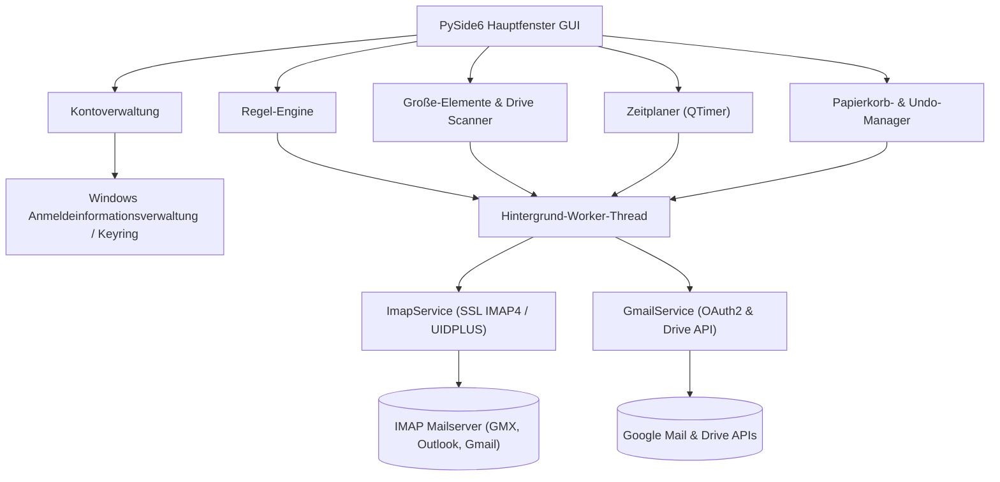

# UniversalMailCleaner

**[🇬🇧 English documentation](README.md)** · **🇩🇪 Deutsch**

> Lokale Windows-Desktop-App zum Aufräumen von IMAP- und Gmail-Postfächern — regelbasierte Bereinigung, Große-Mail-Scans, Scheduler, Safe-Mode.

[](LICENSE)
[](CHANGELOG.md)
[](#überblick)
[](https://pypi.org/project/PySide6/)
[](pyproject.toml)
[](tests)
[](https://github.com/doc-bricks)
[](https://github.com/open-bricks)
[](llms.txt)

> [!NOTE]
> Maschinell lesbare Repository-Übersicht für KI-Agenten und LLMs verfügbar in [`llms.txt`](llms.txt).

UniversalMailCleaner bündelt regelbasierte Mail-Bereinigung, große-Mail- und Drive-Scans, geplante Läufe, Safe-Mode und rückgängig machbare Löschaktionen in einer PySide6-Oberfläche.


## Überblick

UniversalMailCleaner ist für lokale Mail-Aufräumroutinen gedacht: mehrere Konten verwalten, Regeln definieren, große Mails finden und Löschaktionen standardmäßig sicher über den Papierkorb ausführen.

## Warum UniversalMailCleaner

Das Tool richtet sich an Nutzerinnen und Nutzer, die Postfachspeicher und Newsletter-Ballast reduzieren möchten, ohne die eigene Mailbox an einen zusätzlichen Cloud-Dienst zu übergeben. Die App läuft lokal, speichert Passwörter nicht in der Projektkonfiguration, unterstützt normale IMAP-Provider und nutzt die Gmail API nur dort, wo OAuth2-Funktionen gebraucht werden.

## Systemarchitektur



## Einstieg

| Wenn du ... | Starte hier |
|---|---|
| ein Gmail-Postfach ohne gehosteten Cleanup-Dienst aufräumen möchtest | Gmail-API-Konto, Safe-Mode und labelbasierte Bereinigung |
| Speicher in einem klassischen Postfach reduzieren möchtest | IMAP-Konto, Scanner für große Elemente und Papierkorb-Prüfung |
| alte Newsletter oder wiederkehrende Absender entfernen möchtest | Regel-Filter für Alter, Absender, Betreff und Ordner |
| verwandte Mail-Tools prüfen möchtest | [MailProcessor](https://github.com/doc-bricks/MailProcessor), [UniversalDocsGrabber](https://github.com/doc-bricks/UniversalDocsGrabber) und [UniversalInvoiceMail](https://github.com/doc-bricks/UniversalInvoiceMail) |

Geeignet für:

- Gmail-Bereinigung mit OAuth2 und Label-Aktionen
- IMAP-Mail-Aufräumen für GMX, Outlook, Gmail IMAP und weitere SSL-IMAP-Provider
- Suche nach großen E-Mails und optionalen Google-Drive-Dateien
- Geplante Safe-Mode-Bereinigung
- Lokales, datenschutzorientiertes Mail-Management unter Windows

## Funktionen

- Multi-Account-Management für IMAP-Provider plus Gmail API via OAuth2
- Die Google-Clientbibliotheken werden erst geladen, wenn wirklich ein Gmail-API-Konto authentifiziert wird; reine IMAP-Setups starten daher auch ohne die optionalen Gmail-Pakete
- Sichere Passwortspeicherung via `keyring` mit Fallback ohne Persistenz
- Regelbasierte Filter für Alter, Absender, Betreff und Größe
- Mehrordner-Support statt reiner INBOX-Verarbeitung
- Safe-Mode per Papierkorb und Unsafe-Mode für endgültiges Löschen
- Undo für Safe-Mode-Löschaktionen
- Scanner für große Elemente mit tabellarischer Auswahl für Gmail, IMAP und optionale Drive-Bereinigung
- Gmail-spezifische Tabs für Speicherstatistiken und labelbasiertes Aufräumen
- Konfigurierbares Logging über `UMAIL_CLEANER_LOG_LEVEL`
- Modulare Struktur mit `imap_client.py`, `models.py`, `workers.py`, `profile_exchange.py` und `scheduler_widget.py`
- Secrets-freier Profil-Export/-Import für Regeln, Kontometadaten und Scheduler-Vorgaben

## Suchbegriffe

`doc-bricks/UniversalMailCleaner`, `UniversalMailCleaner`, `Gmail Cleaner`, `Gmail aufräumen`, `IMAP Cleaner`, `imap-cleaner`, `Mailbox Cleaner`, `Mailbox Cleanup`, `Postfach aufräumen`, `E-Mail-Bereinigung`, `große Mails finden`, `Gmail Labels aufräumen`, `lokales Mail-Management`, `PySide6 Desktop-App`, `Windows Mail Cleaner`, `sicheres E-Mail-Löschen`

## Suche und Abgrenzung

UniversalMailCleaner ist eine lokale Desktop-App für Mailbox-Bereinigung, kein E-Mail-Marketing-Tool, kein CRM, kein gehosteter Abmeldedienst, kein Mailinglisten-Validator, kein MailCleaner-Anti-Spam-Gateway und keine reine Browser-Erweiterung für Gmail. Das Repository passt am besten zu Suchanfragen nach `doc-bricks/UniversalMailCleaner`, lokaler Gmail-Bereinigung, IMAP-Mailbox-Cleaner, große Mails finden unter Windows, PySide6-Mailverwaltung, Postfach aufräumen ohne Abo, Safe-Mode-Mail-Cleanup und Gmail-Label-Bereinigung mit Undo.

## Start

### Windows

`START.bat` per Doppelklick ausführen

### Manuell

```bash
pip install -e .
universalmailcleaner
```

Legacy-Alternative:

```bash
pip install -r requirements.txt
python mail_imap_cleaner_v1.py
```

## Typischer Workflow

1. IMAP-Konto oder Gmail-API-Konto anlegen
2. Papierkorb-Ordner für IMAP-Konten prüfen oder auto-erkennen lassen
3. Regel definieren oder Scanner für große Elemente nutzen
4. Für Gmail-API-Konten bei Bedarf die Drive-Dateisuche aktivieren
5. Zielordner für IMAP-Regelläufe auswählen
6. Im Safe-Mode ausführen
7. Letzte Löschung bei Bedarf rückgängig machen

## Konfiguration

- Konfigurationsdatei: `%USERPROFILE%\.mail_cleaner\config.json`
- Passwörter werden niemals in der JSON-Datei gespeichert
- Safe-Mode ist standardmäßig aktiv

## Tests

```bash
pytest tests -v
```

## Sicherheit

- IMAP verwendet verschlüsselte Verbindungen (`IMAP4_SSL`)
- Safe-Mode verschiebt E-Mails standardmäßig in den Papierkorb
- Undo für alle Safe-Mode-Löschaktionen verfügbar
- Ohne `keyring` verbleiben Passwörter ausschließlich im Arbeitsspeicher der aktuellen Sitzung

## Unterstützte Provider

- GMX (`imap.gmx.net:993`)
- Gmail via IMAP (`imap.gmail.com:993`) mit App-Passwort
- Gmail via Gmail-API-Konto mit OAuth2 (`credentials.json` erforderlich)
- Outlook (`outlook.office365.com:993`)
- Jeder IMAP4-Provider mit Standard-SSL

## Häufige Fragen (FAQ)

**Gmail-Login schlägt fehl?**
Für IMAP die Zwei-Faktor-Authentifizierung aktivieren und ein App-Passwort erstellen:
[myaccount.google.com/apppasswords](https://myaccount.google.com/apppasswords)

Für Gmail-API-Konten die Datei `credentials.json` neben der Anwendung ablegen und den OAuth2-Browser-Login abschließen.
Die optionalen Google-Client-Pakete werden nur für diesen Gmail-API-Pfad benötigt; die reine IMAP-Nutzung startet auch ohne sie.

Falls von einem älteren Token migriert wird und die Drive-Bereinigung nicht verfügbar ist, `%LOCALAPPDATA%\UniversalMailCleaner\gmail_token.json` einmalig löschen und neu autorisieren.

**Keyring fehlt?**
Installation via `pip install keyring`.

**Papierkorb-Ordner nicht erkannt?**
Im Kontodialog manuell auswählen.

## Ökosystem & Geschwisterwerkzeuge

UniversalMailCleaner ist Teil der **doc-bricks** Produktivitäts- und Dokumentensuite unter dem Dach von **open-bricks**:

| Werkzeug | Fokus & Zweck | Status |
|---|---|---|
| [MailProcessor](https://github.com/doc-bricks/MailProcessor) | Taskleisten-Launcher und Koordinator für alle Universal-Mail-Tools | Produktion |
| [UniversalDocsGrabber](https://github.com/doc-bricks/UniversalDocsGrabber) | Regelbasierte Extraktion von Dokumenten und Anhängen aus IMAP-Postfächern | Produktion |
| [UniversalInvoiceMail](https://github.com/doc-bricks/UniversalInvoiceMail) | Automatisierter Abruf und Ablage von Rechnungen und Belegen aus E-Mails | Produktion |
| [DokuZen](https://github.com/doc-bricks/DokuZen) | Lokale Dokumenten- und PDF-Verwaltungssuite (22 PySide6-Werkzeuge) | Produktion |
| [PDFtoPDFocr](https://github.com/doc-bricks/PDFtoPDFocr) | Optische Zeichenerkennung (OCR) Desktop-App für gescannte PDFs | Produktion |
| [MediaBrain](https://github.com/doc-bricks/MediaBrain) | Multi-Format Medien- und Dokumentenmetadaten-Analyzer & Konverter | Produktion |
| [ProFiler](https://github.com/file-bricks/ProFiler) | Schnelles Dateimanagement, Organisation und Batch-Workflows für Desktop | Produktion |

## Lizenz

[MIT](LICENSE)
